# GenAI-Powered Battery Cell Validation & Testing

## Application Proposals for Cell Validation & Testing Team

> **Date:** February 2026 | **Team:** Cell Validation & Testing (50+ Engineers)
> **Chemistries:** NMC | LFP | NCA
> **Data:** Test Bench Cycling Data + CATL/LG Supplier Data + Cell Spec Sheets
> **Infrastructure:** Hybrid (On-Prem + Cloud)

---

## Master Architecture Overview

```mermaid
graph TB
    subgraph DATA["🔋 DATA SOURCES"]
        direction LR
        TB["Cell Test Bench<br/>Cycling Data<br/>(V, I, T, Capacity)"]
        CATL["CATL<br/>Supplier Data"]
        LG["LG<br/>Supplier Data"]
        SPECS["Cell Spec Sheets<br/>& Datasheets (PDF)"]
    end

    subgraph LAYER["⚙️ GenAI PLATFORM LAYER"]
        direction TB
        ING["Data Ingestion<br/>& Harmonization"]
        VDB["Vector DB<br/>(Embeddings)"]
        LLM["LLM Engine<br/>(GPT-4o / Claude / Llama-3)"]
        RAG["RAG Pipeline<br/>(Domain Knowledge)"]
        AGENTS["AI Agent<br/>Orchestrator"]
    end

    subgraph APPS["🚀 8 GenAI APPLICATIONS"]
        direction TB
        P1["P1: CellChat Copilot"]
        P2["P2: Anomaly Detective"]
        P3["P3: Auto Report Generator"]
        P4["P4: Spec Sheet Intelligence"]
        P5["P5: Test Protocol Optimizer"]
        P6["P6: Cell Comparison Engine"]
        P7["P7: Predictive Life Forecaster"]
        P8["P8: Knowledge Base Agent"]
    end

    subgraph USERS["👥 CELL VALIDATION & TESTING TEAM (50+)"]
        direction LR
        VE["Validation<br/>Engineers"]
        TE["Test<br/>Engineers"]
        TL["Team<br/>Leads"]
        QA["Quality<br/>Assurance"]
    end

    DATA --> LAYER
    LAYER --> APPS
    APPS --> USERS

    style DATA fill:#1a1a2e,stroke:#e94560,color:#fff,stroke-width:2px
    style LAYER fill:#16213e,stroke:#0f3460,color:#fff,stroke-width:2px
    style APPS fill:#0f3460,stroke:#53a8b6,color:#fff,stroke-width:2px
    style USERS fill:#1b1b2f,stroke:#e94560,color:#fff,stroke-width:2px
```



---

## Prioritization Matrix

```mermaid
quadrantChart
    title GenAI Proposals — Impact vs Effort
    x-axis Low Effort --> High Effort
    y-axis Low Impact --> High Impact
    "quadrant-1 Strategic Bets 🔴 "
    "quadrant-2 Quick Wins ✅"
    "quadrant-3 Low Priority"
    "quadrant-4 Major Projects"
    "P4 Spec Sheet Intel: [0.25, 0.70]"
    "P1 CellChat Copilot: [0.40, 0.85]"
    "P3 Auto Reports: [0.35, 0.80]"
    "P6 Cell Compare: [0.45, 0.65]"
    "P8 Knowledge Agent: [0.30, 0.55]"
    "P2 Anomaly Detective: [0.70, 0.90]"
    "P5 Protocol Optimizer: [0.75, 0.75]"
    "P7 Life Forecaster: [0.80, 0.85]"
```

---

## Proposal Summary at a Glance

| # | Proposal | GenAI Tech | Time Saved | Complexity | Priority |
|---|----------|-----------|------------|------------|----------|
| **P1** | CellChat Copilot | Text-to-SQL + LLM | ~70% query time | 🟡 Medium | 🔴 High |
| **P2** | Anomaly Detective | RAG + Time-Series LLM | ~80% detection speed | 🔴 High | 🔴 High |
| **P3** | Auto Report Generator | LLM + Templates | ~90% report time | 🟡 Medium | 🔴 High |
| **P4** | Spec Sheet Intelligence | RAG + PDF Parsing | ~85% search time | 🟢 Low | 🔴 High |
| **P5** | Test Protocol Optimizer | AI Agents + RAG | ~50% protocol design | 🔴 High | 🟡 Medium |
| **P6** | Cell Comparison Engine | LLM + Analytics | ~75% comparison time | 🟡 Medium | 🟡 Medium |
| **P7** | Predictive Life Forecaster | PINN + LLM | ~60% test duration | 🔴 High | 🟡 Medium |
| **P8** | Knowledge Base Agent | Multi-Agent RAG | ~65% onboarding time | 🟢 Low | 🟢 Low |

---

## P1: CellChat Copilot — Natural Language Data Query Interface

### The Problem
Engineers spend **2-4 hours/day** writing SQL queries, navigating dashboards, and manually filtering test data across fragmented tools. 50+ engineers means thousands of hours wasted monthly on data retrieval instead of analysis.

### The Solution
A **conversational AI copilot** that lets engineers query battery test data using plain English. "Show me capacity fade curves for all NMC cells tested above 45°C in the last 6 months" → instant charts + narrative summary.

### Architecture



```mermaid
graph LR
    subgraph INPUT["💬 Engineer Query"]
        Q["'Show me capacity fade<br/>for NMC cells above 45°C<br/>in last 6 months'"]
    end

    subgraph PIPELINE["⚙️ CellChat Pipeline"]
        NLP["NLU Parser<br/>Intent + Entities"]
        SQL["Text-to-SQL<br/>Query Builder"]
        DB["Battery Data<br/>Lake Query"]
        VIZ["Auto-Chart<br/>Generator"]
        NAR["LLM Narrative<br/>Summarizer"]
    end

    subgraph OUTPUT["📊 Response"]
        CHART["📊 Interactive<br/>Capacity Fade Plot"]
        SUM["📝 Natural Language<br/>Summary & Insights"]
        REC["💡 Recommendations<br/>& Next Steps"]
    end

    Q --> NLP --> SQL --> DB --> VIZ --> CHART
    DB --> NAR --> SUM
    NAR --> REC

    style INPUT fill:#2d3436,stroke:#00b894,color:#fff,stroke-width:2px
    style PIPELINE fill:#2d3436,stroke:#6c5ce7,color:#fff,stroke-width:2px
    style OUTPUT fill:#2d3436,stroke:#fdcb6e,color:#fff,stroke-width:2px
```

### Example Queries
| Query | What It Does |
|-------|-------------|
| *"Compare discharge curves of batch A vs batch B at 1C"* | Overlays plots + highlights deviations |
| *"Which cells failed capacity retention below 80% within 500 cycles?"* | Filters + lists + plots failure distribution |
| *"Summarize today's test results for channel 1-20"* | Auto-generates a daily digest |
| *"What's the coulombic efficiency trend for LFP cells this quarter?"* | Time-series trend + statistical summary |

### Tech Stack
- **LLM:** GPT-4o / Claude for NL understanding
- **Text-to-SQL:** Fine-tuned on battery data schema
- **Visualization:** Plotly / Apache ECharts auto-generation
- **Frontend:** Streamlit / Gradio web app
- **Backend:** FastAPI + LangChain agent

### Impact
> **Before:** 2-4 hrs/day per engineer on data retrieval
> **After:** 2-5 minutes per query with auto-generated insights
> **ROI:** ~3,500 engineer-hours saved/month across 50+ team

---

## P2: Anomaly Detective — Real-Time Intelligent Anomaly Detection

### The Problem
Anomalies in cycling data (voltage spikes, temperature excursions, capacity drops) are often caught **hours or days late** through manual review. Late detection = wasted test channels, damaged cells, and missed failure modes.

### The Solution
An **LLM-augmented anomaly detection system** that combines time-series ML models with RAG-powered historical failure pattern matching. Detects anomalies in real-time, classifies severity, and generates root-cause hypotheses.

### Architecture



```mermaid
graph TB
    subgraph STREAM["📡 Real-Time Data Stream"]
        V["Voltage<br/>Waveform"]
        I["Current<br/>Profile"]
        T["Temperature<br/>Sensors"]
        C["Capacity<br/>Tracking"]
    end

    subgraph DETECT["🧠 Anomaly Detection Engine"]
        TS["Time-Series<br/>Embedding Model<br/>(Transformer)"]
        RAG2["RAG: Historical<br/>Failure Pattern DB<br/>(10K+ cases)"]
        LLM2["LLM Reasoning<br/>Engine"]
    end

    subgraph ALERT["🚨 Alert & Action"]
        SEV["🔴🟡🟢<br/>Severity<br/>Classification"]
        ROOT["🔍 Root Cause<br/>Hypothesis"]
        ACT["🛠️ Recommended<br/>Action"]
        DASH["📊 Real-Time<br/>Dashboard"]
    end

    V & I & T & C --> TS
    TS --> LLM2
    RAG2 --> LLM2
    LLM2 --> SEV & ROOT & ACT
    SEV & ROOT & ACT --> DASH

    style STREAM fill:#0a3d62,stroke:#3c6382,color:#fff,stroke-width:2px
    style DETECT fill:#e55039,stroke:#eb2f06,color:#fff,stroke-width:2px
    style ALERT fill:#1e3799,stroke:#4a69bd,color:#fff,stroke-width:2px
```

### Anomaly Types Detected


### How It Works
1. **Time-series model** continuously monitors V, I, T, C streams per channel
2. When deviation detected → **RAG retrieves similar historical patterns** from 10K+ past failure cases
3. **LLM reasons** over current data + historical matches → generates:
   - Severity level (Critical / Warning / Info)
   - Root cause hypothesis with confidence score
   - Recommended action (stop test / adjust params / continue monitoring)
4. Alert pushed to **dashboard + Slack/Teams/Email**

### Impact
> **Detection Time:** Hours/Days → **Seconds**
> **False Positive Reduction:** ~60% fewer false alarms via RAG context
> **Channel Utilization:** +15% by catching stuck/failed tests early
> **Safety:** Thermal runaway precursor detection 10-30 min earlier

---

## P3: Auto Report Generator — One-Click Test Validation Reports

### The Problem
Engineers spend **4-8 hours per report** manually pulling data, creating charts, writing analysis narratives, and formatting documents. With hundreds of test cycles completing weekly, this is a massive bottleneck.

### The Solution
An **AI agent that automatically generates complete validation reports** when a test cycle completes — including charts, statistical analysis, pass/fail determinations, and narrative summaries. Engineers review and approve instead of author.

### Architecture



```mermaid
graph LR
    subgraph TRIGGER["🎯 Trigger"]
        AUTO["Test Cycle<br/>Completes"]
        MAN["Engineer<br/>Request"]
    end

    subgraph ENGINE["⚙️ Report Generation Engine"]
        PULL["Pull Test Data<br/>& Metadata"]
        ANALYZE["LLM Analysis<br/>& Interpretation"]
        TEMPLATE["Template<br/>Matching"]
        CHART2["Auto-Generate<br/>Charts & Tables"]
        NARR["Write Narrative<br/>Sections"]
        COMPLY["Compliance &<br/>Spec Check"]
    end

    subgraph DELIVERABLE["📦 Outputs"]
        PDF["📄 PDF Report<br/>(Branded)"]
        PPT["📊 PowerPoint<br/>Summary Deck"]
        EMAIL["📧 Stakeholder<br/>Email Digest"]
        JIRA["🎫 JIRA/PLM<br/>Updates"]
    end

    AUTO & MAN --> PULL --> ANALYZE --> TEMPLATE
    TEMPLATE --> CHART2 & NARR
    CHART2 & NARR --> COMPLY
    COMPLY --> PDF & PPT & EMAIL & JIRA

    style TRIGGER fill:#6c5ce7,stroke:#a29bfe,color:#fff,stroke-width:2px
    style ENGINE fill:#00b894,stroke:#55efc4,color:#000,stroke-width:2px
    style DELIVERABLE fill:#fdcb6e,stroke:#ffeaa7,color:#000,stroke-width:2px
```

### Report Sections Auto-Generated

| Section | GenAI Capability |
|---------|-----------------|
| **Executive Summary** | LLM distills key findings into 3-5 bullet points |
| **Test Configuration** | Auto-pulled from test bench metadata |
| **Performance Charts** | Discharge curves, capacity fade, Ragone plots, EIS Nyquist |
| **Statistical Analysis** | Automated mean, std dev, Cpk, outlier detection |
| **Pass/Fail Matrix** | Auto-compared against spec sheet limits |
| **Anomaly Narrative** | LLM explains any deviations detected during testing |
| **Comparison to Supplier Data** | Auto-diff vs CATL/LG published specs |
| **Recommendations** | AI-generated next steps based on results |

### Impact
> **Before:** 4-8 hours per report × hundreds of reports/month
> **After:** Auto-generated in minutes, engineer reviews in 15-30 min
> **Consistency:** 100% template adherence, zero formatting errors
> **ROI:** ~2,000+ engineer-hours saved/month

---

## P4: Spec Sheet Intelligence — RAG-Powered Document Brain

### The Problem
Engineers constantly dig through **hundreds of PDFs** — CATL spec sheets, LG datasheets, internal qualification documents, safety standards (IEC 62660, UN38.3, SAE J2464) — to answer specific questions. Information is scattered, unstructured, and often contradictory between versions.

### The Solution
A **RAG (Retrieval-Augmented Generation) system** that ingests all battery cell documentation, creates semantic embeddings, and answers precise questions with source citations. Think "ChatGPT for your spec sheets."

### Architecture


### Key Features
- **Source Citations:** Every answer traces back to exact document + page number
- **Table Extraction:** Parses complex spec sheet tables into queryable data
- **Version Tracking:** Detects conflicts between spec sheet versions
- **Multi-lingual:** Handles Chinese-language CATL documents with translation
- **Compliance Mapping:** Auto-maps cell specs against regulatory requirements

### Impact
> **Before:** 30-60 min searching through PDFs per question
> **After:** 10-second precise answer with source citation
> **Onboarding:** New engineers productive in days instead of weeks
> **Accuracy:** Eliminates manual transcription errors from spec sheets

---

## P5: Test Protocol Optimizer — AI-Designed Test Plans

### The Problem
Designing test protocols for new cells (especially from new suppliers like CATL/LG) requires:
- Deep knowledge of standards (IEC, SAE, UN38.3)
- Understanding of cell chemistry-specific failure modes
- Experience with what test conditions uncover real issues
- Balancing thoroughness vs test channel/time constraints

### The Solution
An **AI agent that designs optimized test protocols** by reasoning over standards, historical test results, cell chemistry knowledge, and channel availability. It generates complete test plans and adapts them based on early results.

### Architecture



```mermaid
graph TB
    subgraph CONTEXT["📋 Context Inputs"]
        CELL["Cell Under Test<br/>(Chemistry, Format,<br/>Supplier)"]
        OBJ["Test Objective<br/>(Qualification, Validation,<br/>Benchmarking)"]
        CONST["Constraints<br/>(Channels, Time,<br/>Budget)"]
    end

    subgraph AGENT["🤖 Protocol Design Agent"]
        STD_RAG["RAG: Standards<br/>& Regulations"]
        HIST_RAG["RAG: Historical<br/>Test Results"]
        CHEM_KB["Chemistry-Specific<br/>Knowledge Base"]
        PLANNER["LLM Protocol<br/>Planner"]
        OPT["Optimization<br/>Engine"]
    end

    subgraph OUTPUT2["📦 Deliverables"]
        PLAN["📋 Complete Test<br/>Protocol Document"]
        SCHED["📅 Channel<br/>Scheduling"]
        RISK["⚠️ Risk-Based<br/>Test Prioritization"]
        ADAPT["🔄 Adaptive<br/>Protocol Updates"]
    end

    CONTEXT --> AGENT --> OUTPUT2

    style CONTEXT fill:#0984e3,stroke:#74b9ff,color:#fff,stroke-width:2px
    style AGENT fill:#d63031,stroke:#ff7675,color:#fff,stroke-width:2px
    style OUTPUT2 fill:#00b894,stroke:#55efc4,color:#000,stroke-width:2px
```

### How the AI Agent Reasons


### Impact
> **Protocol Design Time:** 2-3 days → 2-3 hours
> **Test Efficiency:** ~30% fewer redundant test conditions
> **Risk Coverage:** AI identifies failure modes humans might miss
> **Adaptive:** Protocol auto-adjusts based on early cycle results

---

## P6: Cell Comparison Engine — Multi-Dimensional Benchmarking

### The Problem
Comparing cells across suppliers (CATL vs LG), chemistries (NMC vs LFP vs NCA), and batches requires manually collating data from dozens of sources into spreadsheets. The comparison is often incomplete, biased by what the engineer remembers to include.

### The Solution
An **AI-powered comparison engine** that automatically benchmarks cells across all dimensions — electrical, thermal, degradation, cost, compliance — and generates executive-ready comparison reports with trade-off analysis.

### Architecture


### Sample Output: AI-Generated Comparison

```
┌─────────────────────┬──────────────┬──────────────┬──────────────┐
│ Dimension           │ CATL NMC622  │ LG NMC811    │ Winner       │
├─────────────────────┼──────────────┼──────────────┼──────────────┤
│ Energy Density      │ 240 Wh/kg    │ 270 Wh/kg    │ 🏆 LG       │
│ Cycle Life @1C 25°C │ 2,500 cycles │ 1,800 cycles │ 🏆 CATL     │
│ Max Disch Rate      │ 3C           │ 2C           │ 🏆 CATL     │
│ Thermal Onset       │ 210°C        │ 195°C        │ 🏆 CATL     │
│ $/kWh               │ $62          │ $58          │ 🏆 LG       │
│ Calendar Aging      │ 3%/yr        │ 4%/yr        │ 🏆 CATL     │
├─────────────────────┼──────────────┼──────────────┼──────────────┤
│ AI Recommendation   │ ✅ Best for: high-cycle, high-power apps  │
│                     │ ✅ Best for: energy-dense, cost-sensitive  │
└─────────────────────┴──────────────┴──────────────┴──────────────┘
```

### Impact
> **Comparison Time:** 1-2 days → 15 minutes
> **Dimensions:** Manual 3-4 dimensions → AI covers 20+ automatically
> **Decision Quality:** Data-driven supplier selection replaces gut feel
> **Stakeholder Ready:** Auto-generates exec summary with recommendation

---

## P7: Predictive Life Forecaster — Early-Cycle EOL Prediction

### The Problem
Cycle life testing takes **6-18 months** to run cells to end-of-life. Teams can't make design decisions until tests complete. Early prediction from limited data is the holy grail of cell validation.

### The Solution
A **physics-informed neural network (PINN) + LLM system** that predicts end-of-life, degradation curves, and remaining useful life from just **50-200 early cycles** of data — potentially saving 6-12 months of testing time.

### Architecture



```mermaid
graph LR
    subgraph IN2["📥 Inputs"]
        EARLY["Early Cycle<br/>Data<br/>(50-200 cycles)"]
        CHEM["Cell Chemistry<br/>& Format<br/>(NMC/LFP/NCA)"]
        COND["Operating<br/>Conditions<br/>(T, C-rate, DOD)"]
    end

    subgraph MODEL["🧠 Predictive Engine"]
        PHYS["Physics-Informed<br/>Neural Network<br/>(Degradation Models)"]
        HIST["Historical Aging<br/>Database<br/>(RAG: 1000s of cells)"]
        LLMF["LLM Forecast<br/>Interpreter &<br/>Narrator"]
    end

    subgraph PRED["🔮 Predictions"]
        EOL["📅 End-of-Life<br/>Prediction<br/>(cycles + months)"]
        DEG["📉 Full Degradation<br/>Curve Forecast<br/>(with uncertainty)"]
        CONF["📊 Confidence<br/>Intervals<br/>(±5% at 90% CI)"]
        WHAT["🔮 What-If<br/>Scenarios<br/>(Temp / C-rate)"]
    end

    IN2 --> MODEL --> PRED

    style IN2 fill:#6c5ce7,stroke:#a29bfe,color:#fff,stroke-width:2px
    style MODEL fill:#e17055,stroke:#fab1a0,color:#fff,stroke-width:2px
    style PRED fill:#00b894,stroke:#55efc4,color:#000,stroke-width:2px
```

### What-If Scenario Engine

```mermaid
flowchart LR
    A["Cell: CATL NMC622<br/>Current: 200 cycles<br/>Capacity: 97.2%"] --> B{"What if we<br/>change conditions?"}
    B --> C["Scenario 1<br/>Keep 25°C, 1C<br/>→ EOL: 2,847 cycles"]
    B --> D["Scenario 2<br/>Raise to 45°C, 1C<br/>→ EOL: 1,204 cycles"]
    B --> E["Scenario 3<br/>Keep 25°C, 2C<br/>→ EOL: 1,891 cycles"]
    B --> F["Scenario 4<br/>Real-world drive<br/>→ EOL: 2,156 cycles"]

    style A fill:#0984e3,color:#fff
    style C fill:#00b894,color:#000
    style D fill:#d63031,color:#fff
    style E fill:#fdcb6e,color:#000
    style F fill:#6c5ce7,color:#fff
```



### Impact
> **Test Time Savings:** Predict EOL from 50-200 cycles instead of 2000+
> **Decision Speed:** Cell selection decisions 6-12 months earlier
> **What-If Analysis:** Explore 100s of operating scenarios without physical tests
> **Accuracy Target:** ±5% EOL prediction at 90% confidence

---

## P8: Knowledge Base Agent — Institutional Memory for the Team

### The Problem
With 50+ engineers, critical knowledge is **trapped in individual heads**, scattered emails, old presentations, and tribal knowledge. When experienced engineers leave or rotate, knowledge walks out the door.

### The Solution
A **multi-agent RAG system** that captures, indexes, and makes searchable all team knowledge — test learnings, failure analyses, best practices, onboarding guides, and historical decisions. An always-available senior engineer in chat form.

### Architecture



```mermaid
graph TB
    subgraph KNOW["📚 Knowledge Sources"]
        TEST["Test Learnings<br/>& Post-Mortems"]
        FAIL["Failure Analysis<br/>Reports"]
        BEST["Best Practices<br/>& SOPs"]
        MEET["Meeting Notes<br/>& Decisions"]
        TRAIN["Training<br/>Materials"]
    end

    subgraph AGENT2["🤖 Multi-Agent System"]
        INGEST["Ingestion Agent<br/>(Auto-capture)"]
        INDEX["Indexing Agent<br/>(Semantic + Keyword)"]
        QA_AGENT["QA Agent<br/>(Answer Questions)"]
        UPDATE["Update Agent<br/>(Keep Current)"]
    end

    subgraph USE["👥 Use Cases"]
        ONBOARD["🎓 New Engineer<br/>Onboarding"]
        DEBUG["🔧 Troubleshooting<br/>Test Issues"]
        REVIEW["📋 Design Review<br/>Preparation"]
        LEARN["📖 Continuous<br/>Learning"]
    end

    KNOW --> AGENT2 --> USE

    style KNOW fill:#e17055,stroke:#fab1a0,color:#fff,stroke-width:2px
    style AGENT2 fill:#0984e3,stroke:#74b9ff,color:#fff,stroke-width:2px
    style USE fill:#00b894,stroke:#55efc4,color:#000,stroke-width:2px
```

### Example Interactions
| Question | AI Response |
|----------|-------------|
| *"We're seeing voltage oscillation at low SOC on NMC cells. Has this happened before?"* | "Yes — 3 similar cases found. In Q3-2025, Batch NMC-B042 showed identical behavior. Root cause was electrolyte decomposition at high C-rate low SOC. Resolution: Adjusted CC-CV cutoff. See report TR-2025-0847." |
| *"What's our standard procedure for CATL cell incoming inspection?"* | Retrieves SOP, highlights recent changes, flags common issues found historically |
| *"I'm new to the team. What should I know about NCA cell testing?"* | Generates personalized onboarding guide from accumulated team knowledge |

### Impact
> **Onboarding:** Weeks → Days for new engineers to be productive
> **Knowledge Retention:** Zero knowledge loss from team transitions
> **Troubleshooting:** Instant access to historical solutions
> **Consistency:** Team-wide alignment on best practices

---

## Implementation Roadmap


### Phase Strategy


---

## Tech Stack Recommendation

```mermaid
graph TB
    subgraph INFRA["🏗️ Infrastructure (Hybrid)"]
        subgraph ONPREM["On-Premise"]
            DATA_LAKE["Battery Data Lake<br/>(TimescaleDB / InfluxDB)"]
            VECTOR["Vector Store<br/>(ChromaDB / Milvus)"]
            EDGE["Edge Processing<br/>(Test Bench Integration)"]
        end
        subgraph CLOUD["Cloud"]
            LLM_API["LLM APIs<br/>(Azure OpenAI / AWS Bedrock)"]
            GPU["GPU Compute<br/>(Model Fine-tuning)"]
            MONITOR["Monitoring<br/>(LangSmith / W&B)"]
        end
    end

    subgraph STACK["🛠️ Application Stack"]
        LANG["LangChain / LlamaIndex<br/>(Orchestration)"]
        FAST["FastAPI<br/>(Backend)"]
        STREAM["Streamlit / Gradio<br/>(Frontend)"]
        AGENT_FW["CrewAI / AutoGen<br/>(Multi-Agent)"]
    end

    subgraph MODELS["🧠 Models"]
        GPT["GPT-4o / Claude<br/>(Reasoning)"]
        EMBED_M["text-embedding-3<br/>(Embeddings)"]
        TS_M["TimesFM / Chronos<br/>(Time-Series)"]
        LOCAL["Llama-3 / Mistral<br/>(On-Prem Fallback)"]
    end

    INFRA --> STACK --> MODELS

    style INFRA fill:#2d3436,stroke:#636e72,color:#fff,stroke-width:2px
    style ONPREM fill:#0984e3,stroke:#74b9ff,color:#fff,stroke-width:2px
    style CLOUD fill:#6c5ce7,stroke:#a29bfe,color:#fff,stroke-width:2px
    style STACK fill:#00b894,stroke:#55efc4,color:#000,stroke-width:2px
    style MODELS fill:#e17055,stroke:#fab1a0,color:#fff,stroke-width:2px
```



---

## Estimated Impact Summary


### Total Projected Impact

| Metric | Current State | With GenAI | Improvement |
|--------|--------------|-----------|-------------|
| **Data Query Time** | 2-4 hrs/question | 2-5 min/query | **~95% faster** |
| **Report Generation** | 4-8 hrs/report | 15-30 min review | **~90% faster** |
| **Anomaly Detection** | Hours to days | Real-time (seconds) | **~99% faster** |
| **Spec Sheet Lookup** | 30-60 min | 10 seconds | **~99% faster** |
| **Protocol Design** | 2-3 days | 2-3 hours | **~90% faster** |
| **Cell Comparison** | 1-2 days | 15 minutes | **~95% faster** |
| **Life Prediction** | 6-18 months testing | 50-200 cycles + AI | **~80% faster** |
| **Knowledge Access** | Ask around / search | Instant AI retrieval | **~95% faster** |
| **Monthly Hours Saved** | — | **~14,500 hrs** | **Across 50+ engineers** |

---

## Team Required

| Role | Count | Responsibility |
|------|-------|---------------|
| GenAI/ML Engineer | 3-4 | Build RAG pipelines, fine-tune models, anomaly ML |
| Full-Stack Developer | 2 | Frontend apps, API development, integrations |
| Data Engineer | 1-2 | Data pipeline, harmonization, vector DB |
| Battery Domain SME | 1-2 (part-time) | Validate AI outputs, curate knowledge base |
| MLOps / DevOps | 1 | Infrastructure, monitoring, deployment |
| Product Owner | 1 | Prioritize features, gather user feedback |
| **Total** | **9-12** | |

---

## Risk Mitigation


---

## Next Steps

1. **Align on Priority:** Review proposals P1-P8, confirm Phase 1 selection
2. **Data Audit:** Catalog all available data sources, formats, and volumes
3. **POC Sprint:** 4-week proof-of-concept for P4 (Spec Sheet Intelligence) — lowest risk, immediate value
4. **Infrastructure Setup:** Deploy vector DB + LLM gateway on hybrid infra
5. **Champion Selection:** Identify 5-8 power users from the 50+ team for beta testing

---

> *"The best way to predict battery life is to let AI do it for you."*
> — This Proposal, 2026
