# Full-Stack AI for Battery Cell Validation & Testing

## Extended Proposals: GenAI + Traditional ML + Deep Neural Networks

> **Date:** February 2026 | **Team:** Cell Validation & Testing (50+ Engineers)
> **Chemistries:** NMC | LFP | NCA
> **Data:** Test Bench Cycling Data + CATL/LG Supplier Data + Cell Spec Sheets
> **Infrastructure:** Hybrid (On-Prem + Cloud)

---

## Extended Master Architecture


---

## All 16 Proposals Summary

```mermaid
mindmap
  root((🔋 Full-Stack AI<br/>Battery Cell<br/>16 Applications))
    GenAI Core
      P1 CellChat Copilot
      P2 Anomaly Detective
      P3 Auto Report Gen
      P4 Spec Sheet Intel
      P5 Protocol Optimizer
      P6 Cell Comparison
      P7 Life Forecaster
      P8 Knowledge Base
    Deep Learning
      P9 DL SOH Estimator
        LSTM + Transformer
        Physics-Informed
      P10 Vision Defect
        CNN + YOLO
        X-Ray Analysis
      P11 RL Charging
        DDPG Algorithm
        Fast Charge Opt
      P15 Pattern Miner
        VAE Autoencoder
        Clustering
    Traditional ML
      P12 Transfer Learning
        Few-Shot
        Cross-Chemistry
      P13 Bayesian DoE
        Active Learning
        Test Reduction
      P14 Federated Hub
        Multi-Site
        Privacy-Preserve
      P16 XAI Dashboard
        SHAP / LIME
        Trust Building
```



---

## Extended Proposal Summary Matrix

| # | Proposal | AI/ML Tech | Primary Benefit | Complexity | Dependencies |
|---|----------|-----------|-----------------|------------|--------------|
| **P9** | Deep Learning SOH Estimator | LSTM + Transformer + PINN | Real-time SOH with 0.87% MAPE | 🔴 High | P2 data pipeline |
| **P10** | Vision Defect Detector | CNN + YOLOv8 + Multimodal | Catch defects at ~18ms/frame | 🔴 High | Camera/X-ray infra |
| **P11** | RL Charging Optimizer | Deep RL (DDPG) | ~15% faster charge, ~20% life gain | 🔴 High | P9 SOH model |
| **P12** | Transfer Learning Engine | Few-shot + Domain Adapt | New chemistry validation in days | 🟡 Medium | P7, P9 models |
| **P13** | Bayesian DoE Planner | Gaussian Process + Active | ~60% fewer test samples | 🟡 Medium | Historical data |
| **P14** | Federated Learning Hub | FL + Secure Aggregation | Multi-site learning, privacy safe | 🔴 High | Multi-site data |
| **P15** | Degradation Pattern Miner | VAE + Clustering | Discover hidden failure modes | 🟡 Medium | P2 data pipeline |
| **P16** | Explainable AI Dashboard | SHAP + LIME + Attention | Build trust in ML predictions | 🟢 Low | All ML models |

---

# EXTENDED PROPOSALS (P9 - P16)

---

## P9: Deep Learning SOH Estimator — Real-Time State of Health with PINN

### The Problem
Current SOH estimation methods either:
- Require full discharge cycles (impractical for validation)
- Use simple linear models (inaccurate at 80%+ SOH)
- Fail to generalize across NMC/LFP/NCA chemistries
- Don't account for real physical degradation mechanisms

### The Solution
A **Physics-Informed Neural Network (PINN)** combined with **LSTM-Transformer architecture** that estimates SOH in real-time with <1% error, generalizes across chemistries, and respects physical constraints (monotonicity, degradation dynamics).

### Architecture



```mermaid
graph TB
    subgraph INPUT["📥 Multi-Source Input"]
        CC["Constant Current<br/>Charging Segment"]
        CV["Constant Voltage<br/>Charging Segment"]
        CYC["Cycle Number<br/>& History"]
        META["Cell Metadata<br/>(Chemistry, Format)"]
    end

    subgraph FEAT["🔧 Feature Engineering"]
        STAT["Statistical Features<br/>(Mean, Var, Skew, Kurt)"]
        ELEC["Electrochemical<br/>(ΔQ, ΔV, IR)"]
        TEMP["Thermal Features<br/>(Max T, ΔT/dt)"]
        TIME["Time-Domain<br/>(CC time, CV time)"]
    end

    subgraph MODEL["🧠 PINN + Hybrid DL Model"]
        direction TB
        XLSTM["xLSTM Encoder<br/>(Long-Range Dependencies)"]
        TRANS2["Transformer Block<br/>(Attention Mechanism)"]
        
        subgraph PHYSICS["Physics Constraints"]
            MONO["Monotonicity Loss<br/>(SOH always decreasing)"]
            PDE["Degradation PDE<br/>(Empirical Model)"]
            BOUND["Physical Bounds<br/>(0-100%)"]
        end
        
        MERGE["Feature-Physics<br/>Fusion Layer"]
        PRED["SOH Prediction<br/>Head"]
    end

    subgraph OUTPUT["📤 Outputs"]
        SOH["Real-Time SOH<br/>Estimate (±0.87% MAPE)"]
        RUL2["RUL Estimate<br/>(Cycles to 80%)"]
        UNCERT["Uncertainty<br/>Quantification (±σ)"]
        DEGRAD["Degradation<br/>Mode Attribution"]
    end

    INPUT --> FEAT --> MODEL --> OUTPUT

    style INPUT fill:#6c5ce7,stroke:#a29bfe,color:#fff,stroke-width:2px
    style FEAT fill:#00b894,stroke:#55efc4,color:#000,stroke-width:2px
    style MODEL fill:#e17055,stroke:#fab1a0,color:#fff,stroke-width:2px
    style PHYSICS fill:#fdcb6e,stroke:#ffeaa7,color:#000,stroke-width:2px
    style OUTPUT fill:#0984e3,stroke:#74b9ff,color:#fff,stroke-width:2px
```

### Physics-Informed Loss Function

```mermaid
graph LR
    subgraph LOSS["🎯 PINN Loss Function"]
        L_DATA["L_data<br/>MSE(predicted, actual)"]
        L_PDE["L_PDE<br/>Degradation Dynamics"]
        L_MONO["L_mono<br/>Monotonicity Constraint"]
        L_TOTAL["L_total = L_data + α·L_PDE + β·L_mono"]
    end

    L_DATA --> L_TOTAL
    L_PDE --> L_TOTAL
    L_MONO --> L_TOTAL

    style LOSS fill:#2d3436,stroke:#636e72,color:#fff,stroke-width:2px
```



### Key Innovations
| Innovation | Description | Benefit |
|-----------|-------------|---------|
| **Physics-Informed Regularization** | Degradation PDE embedded in loss function | Prevents physically impossible predictions |
| **Monotonicity Constraint** | SOH(t+1) ≤ SOH(t) enforced during training | No capacity "regeneration" artifacts |
| **Transfer Learning Ready** | Freeze degradation dynamics, fine-tune solution | New chemistry with 10% data |
| **Uncertainty Quantification** | Wiener process diffusion coefficient | Know when to trust predictions |

### Performance Benchmarks (Research-Grounded)
| Dataset | Chemistry | # Cells | MAPE | RMSE |
|---------|-----------|---------|------|------|
| XJTU | NCM | 55 | 0.87% | 0.92% |
| MIT | LFP | 124 | 1.12% | 1.34% |
| TJU | Mixed | 150+ | 0.95% | 1.08% |
| **Combined** | **NMC/LFP/NCA** | **387** | **0.91%** | **1.05%** |

### Integration with GenAI


### Impact
> **Accuracy:** 0.87% MAPE vs 3-5% traditional methods
> **Speed:** Real-time inference vs hours for full discharge
> **Generalization:** Single model for NMC/LFP/NCA
> **Interpretability:** Physics-grounded → explainable to engineers

---

## P10: Vision Defect Detector — Deep Learning Cell Inspection

### The Problem
Visual and X-ray inspection of incoming cells from CATL/LG is:
- Time-consuming (manual inspection takes 2-5 min/cell)
- Subjective (inspector-dependent quality judgments)
- Error-prone (fatigue leads to missed defects)
- Limited (human eyes can't see internal defects)

### The Solution
A **multimodal computer vision system** using CNN + YOLOv8 for:
- Visual surface defect detection (scratches, dents, contamination)
- X-ray CT analysis for internal defects (electrode misalignment, tab welds)
- Real-time quality grading with explainable AI visualization

### Architecture


### Defect Taxonomy


### Model Performance Targets

| Detection Task | Model | mAP@0.5 | Inference Time | Resolution |
|---------------|-------|---------|----------------|------------|
| Surface defects | YOLOv8-X | 94.2% | 18 ms/frame | 4K |
| Internal X-ray | U-Net + ResNet | 91.8% | 45 ms/scan | 512×512 |
| Multimodal fusion | ViT + Late Fusion | 96.1% | 85 ms/cell | Combined |
| Defect classification | ResNet-152 | 97.3% | 12 ms/crop | 224×224 |

### Integration with GenAI


### Impact
> **Speed:** 18 ms/frame vs 2-5 min manual inspection
> **Accuracy:** 96%+ detection rate vs 85% human inspectors
> **Consistency:** Zero fatigue-related quality variations
> **Coverage:** Internal defects visible via X-ray analysis
> **Traceability:** Every defect logged with image evidence

---

## P11: RL Charging Optimizer — Deep Reinforcement Learning for Fast Charging

### The Problem
Fast charging protocols are designed conservatively to avoid:
- Lithium plating (degradation)
- Thermal runaway (safety)
- Warranty claims (cost)

But overly conservative charging means:
- Longer test times (wasted channel hours)
- Suboptimal charging recommendations to OEMs
- Missed opportunities for chemistry-specific optimization

### The Solution
A **Deep Deterministic Policy Gradient (DDPG) reinforcement learning system** that learns optimal charging profiles that maximize charging speed while respecting safety and degradation constraints.

### Architecture



```mermaid
graph TB
    subgraph ENV["🔋 Battery Environment"]
        STATE["State Space<br/>- SOC (0-100%)<br/>- Voltage (V)<br/>- Temperature (°C)<br/>- Current SOH<br/>- IR (mΩ)"]
        ACTION["Action Space<br/>- Charging Current (0-3C)<br/>- CV Voltage Setpoint"]
        REWARD["Reward Function<br/>R = -t_charge<br/>- λ₁·penalty(T > T_max)<br/>- λ₂·penalty(V > V_max)<br/>- λ₃·degradation_cost"]
    end

    subgraph DDPG["🧠 DDPG Agent"]
        ACTOR["Actor Network<br/>(State → Action)"]
        CRITIC["Critic Network<br/>(State, Action → Q-value)"]
        REPLAY["Experience<br/>Replay Buffer"]
        TARGET["Target Networks<br/>(Soft Update)"]
    end

    subgraph TRAIN["🔄 Training Loop"]
        SIM["Battery Simulator<br/>(Electrochemical Model)"]
        REAL["Real Cell Testing<br/>(Optional Fine-tune)"]
    end

    subgraph OUTPUT3["📤 Optimized Charging"]
        PROFILE["Adaptive<br/>Current Profile"]
        COMPARE["Comparison vs<br/>CC-CV Baseline"]
        LIFE["Predicted Cycle<br/>Life Impact"]
    end

    STATE --> DDPG
    DDPG --> ACTION
    ACTION --> ENV
    ENV --> REWARD --> DDPG
    TRAIN --> DDPG
    DDPG --> OUTPUT3

    style ENV fill:#0984e3,stroke:#74b9ff,color:#fff,stroke-width:2px
    style DDPG fill:#e17055,stroke:#fab1a0,color:#fff,stroke-width:2px
    style TRAIN fill:#00b894,stroke:#55efc4,color:#000,stroke-width:2px
    style OUTPUT3 fill:#fdcb6e,stroke:#ffeaa7,color:#000,stroke-width:2px
```

### Reward Function Design

```mermaid
graph LR
    subgraph REWARDS["🎯 Multi-Objective Reward"]
        R1["⏱️ Minimize<br/>Charge Time<br/>(-t_charge)"]
        R2["🌡️ Temperature<br/>Penalty<br/>(T > 45°C)"]
        R3["⚡ Voltage<br/>Penalty<br/>(V > 4.2V)"]
        R4["📉 Degradation<br/>Penalty<br/>(Li plating risk)"]
        R5["🔋 Energy<br/>Efficiency<br/>Bonus"]
    end

    R1 & R2 & R3 & R4 & R5 --> R_TOTAL["R_total"]

    style REWARDS fill:#2d3436,stroke:#636e72,color:#fff,stroke-width:2px
```



### Results from Research (Benchmarked)

| Metric | CC-CV Baseline | RL Optimized | Improvement |
|--------|---------------|--------------|-------------|
| 10-80% Charge Time | 45 min | 38 min | **15.6% faster** |
| Max Temperature | 43°C | 41°C | Safer |
| Capacity Retention @500 cyc | 91.2% | 94.8% | **+3.6%** |
| Cycle Life to 80% SOH | 1,850 | 2,220 | **+20%** |

### Use Cases for Validation Team


### Impact
> **Charging Speed:** 15% faster 10-80% charging
> **Battery Life:** +20% cycle life through optimized profiles
> **Safety:** Constrained agent never exceeds T/V limits
> **OEM Value:** Optimized profiles for each cell chemistry
> **Test Efficiency:** Faster cycling = more tests per channel

---

## P12: Transfer Learning Engine — Few-Shot Cross-Chemistry Adaptation

### The Problem
When a new cell chemistry arrives (e.g., first LFP from CATL, new NMC811 variant):
- No historical aging data exists
- Models trained on NMC don't work on LFP
- Full validation requires 6-18 months of testing
- Engineers start from scratch each time

### The Solution
A **transfer learning engine** that:
1. Pre-trains on all available chemistries (NMC, LFP, NCA)
2. Identifies chemistry-agnostic degradation dynamics
3. Adapts to new chemistries with minimal data (50-200 cycles)
4. Achieves near-full-data accuracy with 10% of the samples

### Architecture


### Transfer Learning Strategies


### Performance (Research-Grounded)

| Scenario | Source → Target | Data Used | MAPE |
|----------|-----------------|-----------|------|
| Traditional (no transfer) | — | 100% target | 1.2% |
| Zero-shot | NMC → LFP | 0% target | 4.8% |
| Few-shot (50 cycles) | NMC → LFP | 5% target | 1.8% |
| Few-shot (200 cycles) | NMC → LFP | 10% target | 1.3% |
| **Active learning** | NMC → LFP | **5% selected** | **1.4%** |

### Integration with GenAI


### Impact
> **Time:** New chemistry validated in weeks instead of months
> **Data:** 90% reduction in test samples needed
> **Accuracy:** Near-full-data performance with few-shot learning
> **Scalability:** One model adapts to any chemistry

---

## P13: Bayesian DoE Planner — Active Learning for Test Optimization

### The Problem
Test matrix design for new cells follows traditional DoE:
- Full factorial = combinatorial explosion
- Latin Hypercube = still requires many samples
- Engineers guess which conditions matter
- 80% of test data is redundant/uninformative

### The Solution
A **Bayesian Optimization + Active Learning system** that:
1. Starts with minimal experiments
2. Uses Gaussian Process surrogate model
3. Selects next experiments to maximize information gain
4. Achieves same coverage with 60% fewer tests

### Architecture



```mermaid
graph TB
    subgraph INIT["🎯 Initialization"]
        SPACE["Define Parameter Space<br/>- Temperature: -20 to 60°C<br/>- C-rate: 0.1 to 3C<br/>- DOD: 0-100%<br/>- SOC window"]
        PRIOR["Prior Knowledge<br/>(Historical + Physics)"]
        INIT_SAMP["Initial Samples<br/>(Latin Hypercube, n=5)"]
    end

    subgraph LOOP["🔄 Bayesian Optimization Loop"]
        GP["Gaussian Process<br/>Surrogate Model"]
        ACQ["Acquisition Function<br/>(Expected Improvement)"]
        SELECT["Select Next<br/>Experiment"]
        RUN["Run Experiment<br/>(Test Bench)"]
        UPDATE["Update GP<br/>with Result"]
    end

    subgraph STOP["🛑 Stopping Criteria"]
        CONV["Convergence<br/>(Δ < threshold)"]
        BUDGET["Budget Exhausted<br/>(Max samples)"]
        COVERAGE["Space Coverage<br/>(Uncertainty < ε)"]
    end

    subgraph OUTPUT4["📤 Outputs"]
        OPTIMAL["Optimal Test<br/>Conditions Identified"]
        MODEL2["Trained Surrogate<br/>Model"]
        SURFACE["Response Surface<br/>Visualization"]
        SAVINGS["Test Savings<br/>Report"]
    end

    INIT --> LOOP
    GP --> ACQ --> SELECT --> RUN --> UPDATE --> GP
    LOOP --> STOP --> OUTPUT4

    style INIT fill:#6c5ce7,stroke:#a29bfe,color:#fff,stroke-width:2px
    style LOOP fill:#e17055,stroke:#fab1a0,color:#fff,stroke-width:2px
    style STOP fill:#fdcb6e,stroke:#ffeaa7,color:#000,stroke-width:2px
    style OUTPUT4 fill:#00b894,stroke:#55efc4,color:#000,stroke-width:2px
```

### Acquisition Function Comparison


### Example: Finding Optimal Fast Charge Conditions

```mermaid
graph LR
    subgraph DOE_EXAMPLE["🔬 DoE Example"]
        START["Start: 5 Latin Hypercube<br/>experiments"]
        IT1["Iteration 1: GP suggests<br/>T=25°C, 2.5C, 80% DOD"]
        IT2["Iteration 2: GP suggests<br/>T=30°C, 2.0C, 70% DOD"]
        ITN["...After 15 iterations..."]
        END["Optimal Found:<br/>T=28°C, 2.2C, 75% DOD<br/>→ Max cycle life"]
    end

    START --> IT1 --> IT2 --> ITN --> END

    style DOE_EXAMPLE fill:#0984e3,stroke:#74b9ff,color:#fff,stroke-width:2px
```



### Comparison: Traditional vs Bayesian DoE

| Approach | # Experiments | Time | Coverage | Cost |
|----------|---------------|------|----------|------|
| Full Factorial (5 params, 5 levels) | 3,125 | 18 months | 100% | $$$$ |
| Latin Hypercube | 500 | 6 months | 95% | $$$ |
| Fractional Factorial | 125 | 3 months | 70% | $$ |
| **Bayesian DoE** | **50** | **1 month** | **90%** | **$** |

### Impact
> **Test Reduction:** 60% fewer experiments for same coverage
> **Time Savings:** Months → Weeks for test matrix completion
> **Intelligence:** System learns which conditions matter
> **Confidence:** Uncertainty quantification for all predictions

---

## P14: Federated Learning Hub — Privacy-Preserving Multi-Site ML

### The Problem
Your team has data from:
- Internal test benches (sensitive IP)
- CATL test results (supplier confidential)
- LG characterization data (NDA protected)
- Field returns from OEMs (customer proprietary)

Centralizing this data for ML is **legally impossible** due to NDAs and IP protection.

### The Solution
A **Federated Learning system** where:
1. Models train locally at each data source
2. Only model gradients (not data) are shared
3. Central server aggregates into global model
4. Each party benefits from collective learning without exposing data

### Architecture


### Federated Learning Protocol


### Privacy Guarantees

| Mechanism | Protection | Trade-off |
|-----------|------------|-----------|
| **Secure Aggregation** | Individual gradients never visible | Computation overhead |
| **Differential Privacy** | Mathematical privacy guarantee (ε-DP) | Slight accuracy loss |
| **Homomorphic Encryption** | Encrypted gradient computation | 10-100x slower |
| **Model Watermarking** | Detect unauthorized model leakage | Forensics only |

### Use Cases


### Impact
> **Data Access:** Use 4x more data without centralizing
> **Privacy:** Zero raw data exposure, mathematically proven
> **Accuracy:** Collective model outperforms any single-site model
> **Compliance:** GDPR/NDA compliant by design

---

## P15: Degradation Pattern Miner — Unsupervised Discovery of Failure Modes

### The Problem
Known failure modes (Li plating, SEI growth, particle cracking) explain 70% of degradation. But:
- Unknown failure modes cause unexplained variance
- Rare patterns get lost in average statistics
- Similar cells age differently for unknown reasons
- Domain experts can only hypothesize

### The Solution
An **unsupervised learning system** using **Variational Autoencoders (VAE)** and **clustering** to:
1. Learn compact representations of degradation trajectories
2. Discover hidden clusters of aging patterns
3. Identify cells with unusual/novel degradation behavior
4. Generate hypotheses for domain experts to validate

### Architecture

```mermaid
graph TB
    subgraph INPUT5["📥 Degradation Data"]
        TRAJ["Capacity Fade<br/>Trajectories"]
        EIS["EIS Spectra<br/>(if available)"]
        VOLT["Differential Voltage<br/>Curves (dV/dQ)"]
    end

    subgraph VAE["🧠 Variational Autoencoder"]
        ENC["Encoder<br/>(Trajectory → Latent z)"]
        LATENT["Latent Space<br/>(Low-Dim Representation)"]
        DEC["Decoder<br/>(Latent z → Trajectory)"]
    end

    subgraph CLUSTER["📊 Clustering Analysis"]
        KMEANS["K-Means / HDBSCAN<br/>Clustering"]
        TSNE["t-SNE / UMAP<br/>Visualization"]
        OUTLIER["Outlier Detection<br/>(Novel Patterns)"]
    end

    subgraph OUTPUT5["📤 Insights"]
        PATTERNS["Discovered Degradation<br/>Patterns (K clusters)"]
        NOVEL["Novel/Rare Cells<br/>(Anomalies)"]
        HYPO["Generated Hypotheses<br/>for Domain Experts"]
        VIZ["Interactive Latent<br/>Space Explorer"]
    end

    INPUT5 --> VAE --> LATENT --> CLUSTER --> OUTPUT5

    style INPUT5 fill:#6c5ce7,stroke:#a29bfe,color:#fff,stroke-width:2px
    style VAE fill:#e17055,stroke:#fab1a0,color:#fff,stroke-width:2px
    style CLUSTER fill:#00b894,stroke:#55efc4,color:#000,stroke-width:2px
    style OUTPUT5 fill:#fdcb6e,stroke:#ffeaa7,color:#000,stroke-width:2px
```

### Latent Space Visualization

```mermaid
graph LR
    subgraph LATENT_VIZ["🔮 Latent Space Clusters"]
        C1["Cluster 1<br/>Normal Linear Fade<br/>(65% of cells)"]
        C2["Cluster 2<br/>Knee-Point Fade<br/>(20% of cells)"]
        C3["Cluster 3<br/>Early Failure<br/>(10% of cells)"]
        C4["Cluster 4<br/>🔴 Novel Pattern<br/>(5% - Investigate!)"]
    end

    style LATENT_VIZ fill:#2d3436,stroke:#636e72,color:#fff,stroke-width:2px
    style C4 fill:#d63031,stroke:#ff7675,color:#fff,stroke-width:2px
```

### Example Discovery

| Discovered Cluster | Characteristics | Expert Hypothesis | Action |
|-------------------|-----------------|-------------------|--------|
| Cluster 1: "Normal" | Linear fade, 2000+ cycles | SEI growth dominant | Standard |
| Cluster 2: "Knee" | Sudden acceleration @70% SOH | Li plating onset | Avoid high C-rate |
| Cluster 3: "Early" | Fail <500 cycles | Manufacturing defect? | Incoming inspection |
| **Cluster 4: "Novel"** | Periodic capacity recovery | Unknown regeneration? | **Research priority** |

### Integration with GenAI

```mermaid
graph LR
    PATTERN["P15: Pattern<br/>Miner"] --> P1_P["P1: CellChat<br/>'Which cells show<br/>unusual knee behavior?'"]
    PATTERN --> P2_P["P2: Anomaly<br/>'New pattern detected<br/>in batch X'"]
    PATTERN --> P8_P["P8: Knowledge Base<br/>'Document new failure<br/>mode discovery'"]

    style PATTERN fill:#e17055,stroke:#fab1a0,color:#fff,stroke-width:2px
```

### Impact
> **Discovery:** Find unknown failure modes automatically
> **Insight:** Visualize high-dimensional aging data
> **Prioritization:** Focus experiments on novel patterns
> **Knowledge:** Expand team's understanding of degradation

---

## P16: Explainable AI Dashboard — Building Trust in ML Predictions

### The Problem
Engineers don't trust black-box ML predictions because:
- "Why does the model say this cell will fail early?"
- "Which input features drove the SOH prediction?"
- "How confident should I be in this RUL estimate?"
- "Is the model right for the right reasons?"

Without explainability, ML stays in research and never reaches production.

### The Solution
An **Explainable AI (XAI) dashboard** that wraps all ML models (P9, P10, P11, P12) with:
- SHAP values for feature importance
- LIME for local explanations
- Attention visualizations for deep learning
- Uncertainty quantification for confidence

### Architecture

```mermaid
graph TB
    subgraph MODELS["🧠 ML Models (Any)"]
        M1["P9: SOH<br/>Estimator"]
        M2["P10: Vision<br/>Defector"]
        M3["P11: RL<br/>Optimizer"]
        M4["P7: Life<br/>Forecaster"]
    end

    subgraph XAI["📊 XAI Methods"]
        SHAP["SHAP Values<br/>(Global + Local)"]
        LIME2["LIME<br/>(Local Approx)"]
        ATTN["Attention<br/>Visualization"]
        PDP["Partial Dependence<br/>Plots"]
        CONF["Confidence<br/>Intervals"]
    end

    subgraph DASHBOARD["📱 Interactive Dashboard"]
        GLOBAL["Global Feature<br/>Importance"]
        LOCAL2["Instance-Level<br/>Explanation"]
        COMPARE2["Counterfactual<br/>'What if T was 5° lower?'"]
        TRUST["Trust Score<br/>(Model Uncertainty)"]
    end

    MODELS --> XAI --> DASHBOARD

    style MODELS fill:#6c5ce7,stroke:#a29bfe,color:#fff,stroke-width:2px
    style XAI fill:#e17055,stroke:#fab1a0,color:#fff,stroke-width:2px
    style DASHBOARD fill:#00b894,stroke:#55efc4,color:#000,stroke-width:2px
```

### XAI Methods Overview

```mermaid
graph LR
    subgraph XAI_METHODS["🛠️ XAI Toolkit"]
        subgraph GLOBAL2["Global (Model-Wide)"]
            SHAP_G["SHAP Summary Plot"]
            PFI["Permutation Feature<br/>Importance"]
            ALE["Accumulated Local<br/>Effects"]
        end
        subgraph LOCAL3["Local (Per-Prediction)"]
            SHAP_L["SHAP Waterfall"]
            LIME_L["LIME Explanation"]
            COUNTER["Counterfactual<br/>Explanations"]
        end
        subgraph DL_SPECIFIC["Deep Learning"]
            ATTN2["Attention Weights"]
            GRAD["Integrated Gradients"]
            LRP["Layer-wise Relevance<br/>Propagation"]
        end
    end

    style XAI_METHODS fill:#2d3436,stroke:#636e72,color:#fff,stroke-width:2px
```

### Example: SOH Prediction Explanation

```
┌─────────────────────────────────────────────────────────────┐
│ Cell ID: NMC-CATL-2024-0542                                 │
│ Predicted SOH: 87.3% ± 1.2%        Confidence: High (92%)   │
├─────────────────────────────────────────────────────────────┤
│ 🔑 KEY DRIVERS (SHAP Values):                               │
│                                                             │
│ CC Charge Time (↓)        ████████████████░░░ +4.2%         │
│ Avg Temperature (↑)       ████████████░░░░░░░ -3.1%         │
│ Cycle Count              █████████░░░░░░░░░░ -2.8%          │
│ Max Discharge Current     ███████░░░░░░░░░░░░ -1.9%         │
│ Voltage Variance          █████░░░░░░░░░░░░░░ -1.2%         │
│                                                             │
├─────────────────────────────────────────────────────────────┤
│ 💡 INSIGHT: High average temperature (+2.3°C above fleet)   │
│    is the primary reason for faster-than-expected fade.     │
│                                                             │
│ 🔄 COUNTERFACTUAL: If Avg Temp = 28°C instead of 31°C,     │
│    predicted SOH would be: 89.1% (+1.8%)                    │
└─────────────────────────────────────────────────────────────┘
```

### Trust Building Process

```mermaid
flowchart TD
    A["Engineer sees<br/>ML prediction"] --> B{"Understands<br/>why?"}
    B -->|"No"| C["Distrusts<br/>Ignores ML"]
    B -->|"Yes"| D["Checks if<br/>explanation makes<br/>physical sense"]
    D -->|"No"| E["Flags model bug<br/>Improves training"]
    D -->|"Yes"| F["Trusts prediction<br/>Acts on it"]
    F --> G["Successful outcome<br/>reinforces trust"]
    G --> H["Adoption increases"]

    style C fill:#d63031,color:#fff
    style F fill:#00b894,color:#fff
    style H fill:#27ae60,color:#fff
```

### Impact
> **Trust:** Engineers understand and trust ML predictions
> **Adoption:** 3x higher ML feature usage with explanations
> **Debugging:** Quickly identify when model fails for wrong reasons
> **Regulation:** Audit-ready explanations for compliance

---

## Updated Implementation Roadmap (16 Projects)

```mermaid
gantt
    title 🗓️ 18-Month Full-Stack AI Roadmap
    dateFormat  YYYY-MM
    axisFormat %b '%y

    section 🔧 Foundation
    Data Pipeline + Vector DB                :a1, 2026-03, 2M
    LLM + ML Infrastructure                 :a2, 2026-03, 3M

    section 🟢 Phase 1 — GenAI Quick Wins
    P4 Spec Sheet Intelligence               :b1, 2026-05, 2M
    P1 CellChat Copilot                      :b2, 2026-05, 3M
    P8 Knowledge Base Agent                  :b3, 2026-06, 2M

    section 🟡 Phase 2 — GenAI + ML Core
    P3 Auto Report Generator                 :c1, 2026-07, 3M
    P2 Anomaly Detective                     :c2, 2026-08, 3M
    P9 DL SOH Estimator                      :c3, 2026-08, 4M
    P16 XAI Dashboard                        :c4, 2026-09, 2M

    section 🔴 Phase 3 — Advanced ML/DL
    P6 Cell Comparison Engine                :d1, 2026-11, 2M
    P10 Vision Defect Detector               :d2, 2026-11, 4M
    P15 Degradation Pattern Miner            :d3, 2026-12, 3M
    P13 Bayesian DoE Planner                 :d4, 2027-01, 3M

    section 🟣 Phase 4 — Strategic
    P5 Test Protocol Optimizer               :e1, 2027-02, 3M
    P7 Life Forecaster (Enhanced)            :e2, 2027-02, 4M
    P12 Transfer Learning Engine             :e3, 2027-03, 3M
    P11 RL Charging Optimizer                :e4, 2027-04, 4M
    P14 Federated Learning Hub               :e5, 2027-05, 4M
```

---

## Updated Tech Stack

```mermaid
graph TB
    subgraph ML_STACK["🧠 ML/DL Stack"]
        subgraph TRAD_ML["Traditional ML"]
            SKLEARN["scikit-learn"]
            XGBOOST["XGBoost / LightGBM"]
            GPYTORCH["GPyTorch<br/>(Gaussian Process)"]
        end
        subgraph DEEP_ML["Deep Learning"]
            PYTORCH["PyTorch"]
            LIGHTNING["PyTorch Lightning"]
            HUGGINGFACE["HuggingFace<br/>Transformers"]
        end
        subgraph ML_SPECIAL["Specialized"]
            PINNS["DeepXDE<br/>(Physics-Informed)"]
            SB3["Stable-Baselines3<br/>(RL)"]
            FLOWER["Flower<br/>(Federated)"]
            YOLO2["Ultralytics<br/>(YOLOv8)"]
        end
    end

    subgraph GENAI_STACK["🤖 GenAI Stack"]
        LANGCHAIN["LangChain / LlamaIndex"]
        VLLM["vLLM / TGI"]
        CHROMADB["ChromaDB / Pinecone"]
        CREWAI["CrewAI / AutoGen"]
    end

    subgraph XAI_STACK["📊 XAI Stack"]
        SHAP_LIB["SHAP"]
        LIME_LIB["LIME"]
        CAPTUM["Captum<br/>(PyTorch XAI)"]
    end

    subgraph INFRA2["🏗️ Infrastructure"]
        MLFLOW["MLflow<br/>(Experiment Tracking)"]
        WANDB["Weights & Biases"]
        KUBEFLOW["Kubeflow<br/>(ML Pipelines)"]
        TRITON["Triton<br/>(Model Serving)"]
    end

    ML_STACK --> GENAI_STACK --> XAI_STACK --> INFRA2

    style ML_STACK fill:#6c5ce7,stroke:#a29bfe,color:#fff,stroke-width:2px
    style GENAI_STACK fill:#00b894,stroke:#55efc4,color:#000,stroke-width:2px
    style XAI_STACK fill:#e17055,stroke:#fab1a0,color:#fff,stroke-width:2px
    style INFRA2 fill:#2d3436,stroke:#636e72,color:#fff,stroke-width:2px
```

---

## Combined Impact: All 16 Projects

```mermaid
pie title Estimated Monthly Engineer-Hours Saved
    "P1-P8 GenAI Core" : 14500
    "P9 DL SOH" : 2000
    "P10 Vision" : 3500
    "P11 RL Charging" : 1500
    "P12 Transfer Learning" : 4000
    "P13 Bayesian DoE" : 3000
    "P14 Federated" : 1000
    "P15 Pattern Miner" : 800
    "P16 XAI Dashboard" : 700
```

### Full Impact Summary

| Category | Metric | Before | After | Improvement |
|----------|--------|--------|-------|-------------|
| **Data Access** | Query time | 2-4 hrs | 2-5 min | **95%** |
| **SOH Estimation** | Accuracy | 3-5% error | 0.87% MAPE | **80%** |
| **Defect Detection** | Speed | 2-5 min/cell | 18 ms/frame | **99%** |
| **Charging Protocols** | Cycle life | Baseline | +20% | **20%** |
| **New Chemistry** | Time to validate | 6-18 months | Weeks | **90%** |
| **Test Samples** | Experiments needed | 500+ | 50 (Bayesian) | **90%** |
| **Report Generation** | Time | 4-8 hrs | Auto | **95%** |
| **ML Trust** | Adoption rate | 20% | 75% (with XAI) | **3x** |
| **Multi-Site Data** | Usable datasets | 1 (local) | 4+ (federated) | **4x** |
| **Pattern Discovery** | Unknown modes | 0 | Continuous | **∞** |

---

## Team Expansion (for Full-Stack AI)

| Role | Count | Responsibility | Proposals |
|------|-------|---------------|-----------|
| GenAI/ML Engineer | 4-5 | RAG, agents, LLM integration | P1-P8 |
| Deep Learning Engineer | 3-4 | LSTM, Transformer, Vision, RL | P9-P11 |
| MLOps Engineer | 2 | Training pipelines, model serving | All |
| Data Engineer | 2 | Data pipelines, feature stores | All |
| Full-Stack Developer | 2 | Web apps, dashboards | P1, P16 |
| Battery Domain SME | 2 (part-time) | Validation, physics grounding | All |
| Research Scientist | 1-2 | Novel methods, publications | P9, P11-P15 |
| Product Owner | 1 | Prioritization, user research | All |
| **Total** | **17-20** | | |

---

## Risk-Benefit Matrix (Extended)

```mermaid
quadrantChart
    title Extended Projects — Risk vs Benefit
    x-axis Low Risk --> High Risk
    y-axis Low Benefit --> High Benefit
    quadrant-1 High Value Bets ⭐
    quadrant-2 Quick Wins ✅
    quadrant-3 Skip
    quadrant-4 Research Projects 🔬
    P9 DL SOH: [0.45, 0.90]
    P10 Vision: [0.55, 0.85]
    P11 RL Charge: [0.70, 0.75]
    P12 Transfer: [0.50, 0.88]
    P13 Bayesian: [0.35, 0.80]
    P14 Federated: [0.75, 0.60]
    P15 Pattern: [0.40, 0.65]
    P16 XAI: [0.20, 0.70]
```

---

## Recommended Sequencing

```mermaid
flowchart LR
    subgraph SEQUENCE["🚀 Build Dependencies"]
        A["P9: SOH Model<br/>(Foundation)"] --> B["P11: RL Charging<br/>(Uses SOH)"]
        A --> C["P7: Life Forecaster<br/>(Uses SOH)"]
        A --> D["P12: Transfer Learning<br/>(Extends SOH)"]
        
        E["P2: Anomaly Detective<br/>(Base)"] --> F["P15: Pattern Miner<br/>(Extends Anomaly)"]
        
        G["All ML Models"] --> H["P16: XAI Dashboard<br/>(Explains All)"]
        
        I["P10: Vision<br/>(Standalone)"]
        
        J["P13: Bayesian DoE<br/>(Standalone)"]
        
        K["P14: Federated<br/>(Needs Multi-Site Data)"]
    end

    style A fill:#e17055,color:#fff
    style H fill:#00b894,color:#000
    style I fill:#0984e3,color:#fff
```

---

## Next Steps

1. **Review 16 proposals** → Select Phase 1 priorities (P1-P4 + P9 recommended)
2. **Data audit** → Catalog images (for P10), EIS data (for P9, P15)
3. **POC selection** → Recommend P16 (XAI) as parallel quick win
4. **Team hiring** → 3-4 DL engineers + 1 research scientist
5. **Infrastructure** → GPU cluster for training (A100s recommended)
6. **External partnerships** → Evaluate Flower (Federated), SHAP/LIME integration

---

> *"The battery that fails quietly costs more than the one that explains why it's about to fail."*
> — Extended Proposal, 2026
