# Section 1: How AI Systems Think

> **Time:** 3-4 hours  
> **Day:** 1 (Morning)  
> **Goal:** Build intuition for what's happening inside an LLM — from raw text to intelligent output

---

## Why This Section First

You cannot design intelligent systems if you don't understand the engine. This isn't about memorizing math — it's about building **accurate mental models** so you can predict behavior, diagnose failures, and make architecture decisions.

> *"You don't need to know how to build an engine to be a race car driver. But you need to know how engines work to design a race car."*

---

## 1.1 From Text to Numbers: Tokenization

### The Core Problem
Computers don't understand text. They understand numbers. **Tokenization** is the bridge.

### What Actually Happens

```
Input:  "The battery temperature is 45°C"
         ↓ Tokenizer
Tokens: ["The", " battery", " temperature", " is", " 45", "°", "C"]
         ↓ Token IDs
Numbers: [464, 9977, 5951, 318, 4153, 7461, 34]
```

### Three Tokenization Strategies

| Strategy | How It Works | Trade-off |
|----------|-------------|-----------|
| **BPE** (Byte Pair Encoding) | Merges frequent character pairs iteratively | Most common (GPT, Claude). Good balance of vocab size vs coverage |
| **WordPiece** | Similar to BPE but uses likelihood, not frequency | Used by BERT. Better for classification tasks |
| **SentencePiece** | Treats input as raw bytes, language-agnostic | Handles any language/script. Used by LLaMA, T5 |

### Architect's Mental Model

> **Tokens are the atoms of AI language.** Every decision the model makes happens at the token level. Every cost you pay is per-token. Every context limit is in tokens.

### Why This Matters for Architecture

1. **Cost estimation:** 1 token ≈ 0.75 English words. A 1000-word document ≈ 1,333 tokens
2. **Context limits:** GPT-4o: 128K tokens. Claude: 200K tokens. These are HARD limits
3. **Domain vocabulary:** Technical terms like "SOC" (State of Charge) may tokenize badly → more tokens → higher cost + possible confusion
4. **Multilingual:** Non-English text often uses 2-4x more tokens for the same meaning

### Architect Question
> *Your EV fleet system processes 10,000 maintenance reports per day, each ~500 words. At $0.003/1K input tokens + $0.015/1K output tokens (GPT-4o), what's your daily API cost if each report gets a 200-word analysis? How would you reduce it?*

<details>
<summary>Think first, then check</summary>

**Inputs:** 10,000 × 667 tokens = 6.67M tokens → $20/day  
**Outputs:** 10,000 × 267 tokens = 2.67M tokens → $40/day  
**Total:** ~$60/day → ~$1,800/month  

**Reduction strategies:**
- Batch similar reports before sending to LLM
- Use a smaller model (Haiku) for routine reports, route complex ones to Sonnet
- Cache identical/similar queries
- Summarize reports before LLM processing (reduce input tokens)
- Fine-tune a smaller model if patterns are predictable
</details>

---

## 1.2 Embeddings: Meaning as Coordinates

### The Core Idea
An **embedding** is a list of numbers (a vector) that captures the *meaning* of a piece of text. Similar meanings → nearby vectors.

```
"battery overheating"  → [0.82, -0.15, 0.44, ..., 0.91]  (768+ dimensions)
"thermal runaway"      → [0.79, -0.18, 0.41, ..., 0.88]  (nearby!)
"tire pressure low"    → [0.12, 0.67, -0.33, ..., 0.05]  (far away)
```

### How Similarity Works

```
                    "battery overheating"
                         •
                        /
                       / cos θ = 0.95 (very similar)
                      /
     "thermal runaway" •

                                        • "tire pressure low"
                                          cos θ = 0.23 (unrelated)
```

**Cosine similarity** measures the angle between vectors:
- 1.0 = identical meaning
- 0.0 = unrelated
- -1.0 = opposite meaning

### Embedding Models: The Trade-offs

| Model | Dimensions | Speed | Quality | Use When |
|-------|-----------|-------|---------|----------|
| `text-embedding-3-small` (OpenAI) | 1536 | Fast | Good | Prototyping, cost-sensitive |
| `text-embedding-3-large` (OpenAI) | 3072 | Slower | Better | Production with budget |
| `voyage-3` (Voyage AI) | 1024 | Fast | Excellent for code/tech | Technical documentation |
| `nomic-embed-text` (Open source) | 768 | Fast | Good | Self-hosted, privacy-critical |
| `BGE-M3` (BAAI, Open source) | 1024 | Medium | Excellent multilingual | Multi-language systems |

### Architect's Mental Model

> **Embeddings are coordinates in meaning-space.** The embedding model defines the "map." Different maps emphasize different things. Choose the map that makes the distinctions your application cares about.

### Why This Matters for Architecture

1. **Vector databases** store and search these embeddings (this is how RAG works)
2. **Embedding quality determines retrieval quality** — garbage embeddings, garbage results
3. **Dimension size = storage cost.** 3072-dim × 1M documents × 4 bytes = ~12 GB
4. **You can't mix embedding models.** If you embed documents with model A, you must query with model A
5. **Domain matters.** General-purpose embeddings may not capture "SOC" vs "SOH" distinctions well

### Architect Question
> *You're building a search system over 50,000 EV battery technical documents. You need to handle queries in English and German. What embedding model would you choose and why? What's your estimated storage requirement?*

<details>
<summary>Think first, then check</summary>

**Choice:** BGE-M3 (multilingual, 1024 dimensions, open source, strong technical performance)

**Storage:** 50,000 docs × avg 20 chunks/doc = 1M vectors  
1M × 1024 dims × 4 bytes = ~4 GB for vectors alone  
Plus metadata, indices → ~6-8 GB total

**Alternatives considered:**
- OpenAI `text-embedding-3-large`: Better quality but API dependency, ongoing cost, data leaves your infra
- `nomic-embed-text`: Good but weaker multilingual
- `Cohere embed-multilingual-v3.0`: Strong multilingual but API-dependent
</details>

---

## 1.3 The Transformer: How Attention Works

### Why Transformers Changed Everything
Before transformers (2017), AI processed text sequentially — word by word, like reading with a flashlight. Transformers process **all words simultaneously** and learn **which words should pay attention to which**.

### The Attention Mechanism (Intuition)

Consider: *"The truck's battery failed because **it** overheated during charging"*

The word "it" needs to know it refers to "battery" (not "truck" or "charging"). **Attention** is the mechanism that creates this connection.

```
         The  truck  battery  failed  because  it  overheated  charging
The       ·    ·      ·        ·        ·      ·      ·          ·
truck     ·    ·      ·        ·        ·      ·      ·          ·
battery   ·    ·      █        ·        ·      █      █          ·
failed    ·    ·      █        ·        ·      ·      ·          ·
because   ·    ·      ·        █        ·      ·      ·          ·
it        ·    ·      █        ·        ·      ·      █          ·
overheated·    ·      █        ·        ·      █      ·          █
charging  ·    ·      ·        ·        ·      ·      █          ·

█ = strong attention    · = weak attention
```

### Query-Key-Value: The Three Roles

Every token plays three roles simultaneously:

| Role | Analogy | What It Does |
|------|---------|--------------|
| **Query (Q)** | "What am I looking for?" | The question this token asks |
| **Key (K)** | "What do I contain?" | The label this token advertises |
| **Value (V)** | "What information do I provide?" | The actual content to pass along |

**The process:**
1. Each token generates Q, K, V vectors
2. Each token's Q is compared against ALL other tokens' K's → attention scores
3. Scores are used to create a weighted mix of V's → the enriched representation

$$\text{Attention}(Q, K, V) = \text{softmax}\left(\frac{QK^T}{\sqrt{d_k}}\right)V$$

**In plain language:** "For each word, look at every other word, figure out which ones matter most, and blend their information accordingly."

### Multi-Head Attention

One attention head might learn syntax (subject-verb agreement). Another learns factual associations. Another learns coreference (what "it" refers to). **Multiple heads = different angles on meaning**.


### The Full Transformer Architecture (Decoder-Only for LLMs)

```mermaid
flowchart TB
    Input["Input Tokens"] --> Embed["Token + Position<br/>Embeddings"]
    
    subgraph Block["Transformer Block × N"]
        direction TB
        Attn["🎯 Masked Multi-Head Attention<br/><i>Each token attends to previous only</i>"]
        Norm1["Layer Norm + Residual"]
        FFN["💾 Feed-Forward Network<br/><i>Where 'knowledge' is stored</i>"]
        Norm2["Layer Norm + Residual"]
        
        Attn --> Norm1 --> FFN --> Norm2
    end
    
    Embed --> Block
    Block -->|"Repeat 80-120 layers"| Output["Vocabulary Probabilities"]
    Output --> Next["📝 Next Token Prediction"]
    
    style Block fill:#1a1a2e,stroke:#4a4a6a,color:#fff
    style Input fill:#16213e,stroke:#1f4068,color:#fff
    style Next fill:#2d5016,stroke:#4a7c23,color:#fff
```



### Architect's Mental Model

> **A transformer is a prediction machine.** Given everything that came before, it predicts the most likely next token. It achieves this by letting every token "talk to" every previous token through attention. The magic is that this simple mechanism, scaled up, produces reasoning, coding, and creativity.

### Key Numbers to Know

| Model | Parameters | Layers | Attention Heads | Context Window |
|-------|-----------|--------|-----------------|----------------|
| GPT-4o | ~200B (est.) | ~120 | ~96 | 128K tokens |
| Claude Sonnet 4 | ~70B (est.) | ~80 | ~64 | 200K tokens |
| LLaMA 3 70B | 70B | 80 | 64 | 128K tokens |
| Mistral 7B | 7B | 32 | 32 | 32K tokens |

### Architect Question
> *Why does a 70B parameter model cost ~10x more to run than a 7B model, but doesn't give 10x better answers? What's the architectural reason?*

<details>
<summary>Think first, then check</summary>

**Cost scaling:** Cost scales roughly linearly with parameters (more weights = more compute per token). 70B ÷ 7B = 10x.

**Quality scaling:** Quality scales **logarithmically** with parameters (diminishing returns). Each 10x increase in parameters gives ~20-30% improvement on benchmarks, not 10x.

**Why:** The additional parameters help with edge cases, nuance, and rare knowledge. For common tasks, the smaller model already captures the patterns. The 70B model's advantage shows up on harder, more ambiguous tasks.

**Architecture decisions this informs:**
- Use smaller models for well-defined, routine tasks (classification, extraction)
- Use larger models for reasoning, nuanced generation, complex instructions
- **Model routing** = different models for different task difficulties = cost optimization
</details>

---

## 1.4 How LLMs Actually Generate Text

### Autoregressive Generation
LLMs generate text **one token at a time**, left to right. Each new token is chosen based on ALL previous tokens.

```
Prompt:  "The EV battery failed because"
Step 1:  → "the"     (P=0.34)
Step 2:  → "cooling"  (P=0.28)
Step 3:  → "system"   (P=0.61)
Step 4:  → "mal"      (P=0.45)
Step 5:  → "functioned" (P=0.72)
...
Output: "The EV battery failed because the cooling system malfunctioned"
```

### Temperature: Controlling Randomness

| Temperature | Behavior | Use Case |
|------------|----------|----------|
| 0.0 | Always picks highest probability token (deterministic) | Code generation, factual Q&A, structured output |
| 0.3-0.5 | Mostly predictable, slight variation | Technical writing, analysis |
| 0.7-0.9 | Creative, varied outputs | Brainstorming, marketing copy |
| 1.0+ | Increasingly random, may become incoherent | Experimental, poetry |

### Architect's Mental Model

> **An LLM doesn't "know" things. It has learned statistical patterns from vast text.** When it gives a correct answer, it's because the pattern is well-represented in training data. When it hallucinates, the pattern is weak or absent and it's **confidently interpolating**.

### The Implications Every Architect Must Internalize

| Fact | Implication for Architecture |
|------|------------------------------|
| LLMs are probabilistic, not deterministic | Same input can give different outputs. Build for variability |
| Knowledge has a training cutoff | Need RAG or tools for current/proprietary information |
| LLMs can't verify their own outputs | External validation is YOUR responsibility |
| Longer context ≠ better reasoning | Models degrade with context length. "Lost in the middle" problem |
| LLMs are token-prediction, not truth-seeking | They optimize for plausible-sounding, not correct |
| Confidence ≠ correctness | An LLM saying "definitely" doesn't mean it's right |

---

## 1.5 Context Windows: The Working Memory

### What Is a Context Window?
The context window is the total number of tokens the model can "see" at once — both your input AND its output.

```
┌──────────────────── Context Window (e.g., 128K tokens) ──────────────────┐
│                                                                          │
│  [System Prompt] [Retrieved Context] [User Message] [Model Response]     │
│  ~~~~~~~~~~~~    ~~~~~~~~~~~~~~~~~~  ~~~~~~~~~~~~~  ~~~~~~~~~~~~~~~~     │
│    ~500 tokens     ~2000 tokens       ~200 tokens     ~1000 tokens       │
│                                                                          │
│  Used: ~3,700 tokens                 Remaining: ~124,300 tokens          │
└──────────────────────────────────────────────────────────────────────────┘
```

### The "Lost in the Middle" Problem

Research shows LLMs attend most to the **beginning** and **end** of the context, losing information in the middle.

```
Attention strength across context window:

█████████▓▓▓▒▒▒░░░░░░░░░░░░░░░░░▒▒▒▓▓▓██████████
^                                              ^
Beginning                                    End
(strong)         Middle (WEAK)             (strong)
```

**Architecture implications:**
- Put the most important context at the **beginning** or **end**
- Don't dump everything into context — curate
- Summarize long documents rather than stuffing them in
- Use retrieval to select RELEVANT context, not ALL context

### Architect's Mental Model

> **Context window is working memory, not storage.** Bigger isn't always better. A smaller, well-curated context often outperforms a larger, noisy one. Your job as architect is to engineer what goes IN, not just how much fits.

---

## 1.6 Open vs Closed Models: The Strategic Decision

### The Landscape (2026)

```
                    Capability
                        ↑
          GPT-4o ●  ● Claude Sonnet 4
                    ● Gemini 2.0 Pro
                    ●
          LLaMA 3  ●  ● Mistral Large
           70B        ● Qwen 2.5 72B
                    ●
          Mixtral   ●  ● Command R+
                    ●
          LLaMA 3  ●  ● Phi-3-medium
           8B         ● Gemma 2 9B
                    ●
          Mistral  ●
           7B      
        ──────────────────────→ Control/Privacy
        API-only        Self-hosted
        (Closed)         (Open)
```

### Decision Matrix

| Factor | Closed (API) | Open (Self-hosted) |
|--------|-------------|-------------------|
| **Getting started** | Minutes | Hours to days |
| **Quality ceiling** | Highest (GPT-4o, Claude) | Close but slightly behind |
| **Cost at low volume** | Cheap (pay per token) | Expensive (GPU infra) |
| **Cost at high volume** | Expensive (tokens add up) | Cheaper (fixed infra cost) |
| **Data privacy** | Data leaves your infra | Data stays on your infra |
| **Latency control** | Limited (API queue) | Full control |
| **Customization** | Prompts only (mostly) | Fine-tune, modify, combine |
| **Reliability** | Dependent on provider uptime | Your responsibility |
| **Regulatory** | May not meet compliance | Full compliance control |

### Architect's Decision Framework

```mermaid
flowchart TD
    Start([Start]) --> Privacy{Data Privacy<br/>Critical?}
    Privacy -->|Yes| Open["✅ Open Model<br/>(Self-Hosted)"]
    Privacy -->|No| Proto{Prototype<br/>Stage?}
    
    Proto -->|Yes| Closed["✅ Closed API<br/>(Fast Iteration)"]
    Proto -->|No| Volume{"Volume ><br/>1M tokens/day?"}
    
    Volume -->|Yes| CostAnalysis{Cost Analysis}
    Volume -->|No| Quality{Need Best<br/>Quality?}
    
    CostAnalysis --> GPU{"Have GPU<br/>Infra?"}
    GPU -->|Yes| OpenCost["✅ Open Model"]
    GPU -->|No| ClosedCost["✅ Closed API"]
    
    Quality -->|Yes| ClosedQ["✅ Closed API<br/>(GPT-4o, Claude)"]
    Quality -->|No| Optimal["✅ Open Model<br/>(Cost + Control)"]
    
    style Open fill:#2d5016,stroke:#4a7c23,color:#fff
    style Closed fill:#1a4d8f,stroke:#2a6ab8,color:#fff
    style OpenCost fill:#2d5016,stroke:#4a7c23,color:#fff
    style ClosedCost fill:#1a4d8f,stroke:#2a6ab8,color:#fff
    style ClosedQ fill:#1a4d8f,stroke:#2a6ab8,color:#fff
    style Optimal fill:#2d5016,stroke:#4a7c23,color:#fff
```



### Architect Question
> *Your EV fleet system handles sensitive vehicle telemetry data subject to automotive industry data governance. You need real-time diagnostics (~500ms latency) processing 50,000 queries/day. Open or closed model? Which specific model and why?*

<details>
<summary>Think first, then check</summary>

**Decision: Open model** — data privacy is the deciding factor for automotive telemetry.

**Specific model:** LLaMA 3 8B (or Mistral 7B) fine-tuned on EV domain data.

**Reasoning:**
1. **Privacy:** Automotive telemetry can't be sent to third-party APIs (GDPR, automotive data governance)
2. **Latency:** 500ms is achievable with a 7-8B model on a single A100 GPU. API calls typically take 500-2000ms
3. **Volume:** 50K queries/day × ~1K tokens each = 50M tokens/day. At API pricing this is ~$150-750/day. Self-hosted GPU is ~$50-100/day
4. **Domain fit:** Fine-tuning on EV technical data will make a small model outperform a general large model for this specific domain
5. **Why not larger:** 70B model needs 4x GPUs, higher latency, and the diagnostic task is domain-specific enough that a fine-tuned small model works

**Risk:** Fine-tuning requires labeled data. Mitigation: Start with Claude API for prototype, collect data, then transition to fine-tuned open model.
</details>

---

## 1.7 Training vs Inference: The Two Modes

### Training (You Won't Do This, But Must Understand It)

```
Training Data (TB of text)
    ↓
┌─────────────────────────────┐
│ For each batch of text:      │
│  1. Predict next token       │
│  2. Compare to actual token  │
│  3. Compute loss             │
│  4. Update weights           │
│  (repeat billions of times)  │
└─────────────────────────────┘
    ↓
Trained model (billions of parameters)
```

**Cost:** GPT-4 estimated at $100M+. LLaMA 3 70B at ~$10M.  
**Time:** Weeks to months on thousands of GPUs.  
**Data:** Trillions of tokens from the internet, books, code.

### Fine-Tuning (You Might Do This)

```
Pre-trained model + Your domain data
    ↓
┌─────────────────────────────┐
│ Adjust weights slightly      │
│ to specialize in your domain │
│ (hours, not months)          │
└─────────────────────────────┘
    ↓
Domain-specialized model
```

**When to fine-tune:**
- Specific output format needed consistently
- Domain terminology the base model struggles with
- Need to reduce prompt size (bake instructions into weights)
- Privacy: encode knowledge so it doesn't need to be in the prompt

**When NOT to fine-tune:**
- RAG can solve it (usually try RAG first)
- You don't have enough quality training data (~1000+ examples minimum)
- The task is well-served by prompting

### Inference (Your Primary Concern)

```
User query + Context
    ↓
┌─────────────────────────────┐
│ Forward pass through model   │
│ (no weight updates)          │
│ Generate tokens one by one   │
└─────────────────────────────┘
    ↓
Response
```

**What you control at inference:**
- Which model to call
- What context to provide
- Temperature, max tokens, stop sequences
- Whether to stream or batch
- How to parse and validate the output

### The Cost of Inference

| Model | Input (per 1M tokens) | Output (per 1M tokens) | Tokens/second |
|-------|----------------------|----------------------|---------------|
| GPT-4o | ~$2.50 | ~$10.00 | ~80-100 |
| Claude Sonnet 4 | ~$3.00 | ~$15.00 | ~60-80 |
| Claude Haiku 4 | ~$0.25 | ~$1.25 | ~150+ |
| LLaMA 3 70B (self-hosted) | ~$0.50 (compute) | ~$0.50 (compute) | ~40-60 |
| Mistral 7B (self-hosted) | ~$0.05 (compute) | ~$0.05 (compute) | ~100+ |

### Architect's Mental Model

> **You are an inference architect.** Your job is to get the best output quality at acceptable cost and latency. Training is someone else's problem. Inference optimization is YOUR competitive advantage.

---

## Section 1 Summary: Key Mental Models

| Concept | Mental Model | One-Liner |
|---------|-------------|-----------|
| Tokens | Atoms of AI language | Everything is measured in tokens |
| Embeddings | Coordinates in meaning-space | Similar meaning = nearby vectors |
| Attention | Every word talks to every other word | The mechanism that creates understanding |
| Transformer | A prediction machine | Given past, predict next — at massive scale |
| Context Window | Working memory, not storage | Curate what goes in, don't just fill it |
| Open vs Closed | A strategic trade-off, not a quality judgment | Privacy, cost, control vs convenience, cutting-edge |
| Inference | Your primary concern | Optimize for quality × cost × latency |

### You Should Now Be Able To:
- [ ] Trace the path from raw text → tokens → embeddings → attention → output
- [ ] Estimate token costs for a production scenario
- [ ] Choose between open and closed models for a given use case
- [ ] Explain why LLMs hallucinate (fundamental to their architecture)
- [ ] Describe what the context window is and its limitations

---

*Next: [Section 2 — Design Intelligent Systems →](02_design_intelligent_systems.md)*
