# Section 2: Design Intelligent Systems

> **Time:** 4-5 hours  
> **Day:** 1 (Afternoon/Evening)  
> **Goal:** Master the architecture patterns that make AI systems actually work — not just demo, but production

---

## The Architect's Core Question

> *"Given a problem, what's the simplest AI architecture that solves it reliably?"*

Most failures in AI systems aren't model failures — they're **architecture failures**. The model is fine; what you feed it, how you orchestrate it, and what you do with its output is broken.

---

## 2.1 Context Engineering: The #1 Skill of 2026

### What Is Context Engineering?

Prompt engineering asks: *"How do I write good instructions?"*  
Context engineering asks: *"How do I design the entire informational environment in which the AI operates?"*

> *"Context engineering is the art of providing the right information, in the right format, at the right time, to the AI model."* — Simon Willison

### The Context Stack

Everything the model sees is its context. You control ALL of it:

```
┌─────────────────────────────────────────────────┐
│                 CONTEXT WINDOW                   │
│                                                  │
│  ┌────────────────────────────────────────────┐  │
│  │  SYSTEM PROMPT                              │  │
│  │  • Role definition                          │  │
│  │  • Behavioral constraints                   │  │
│  │  • Output format requirements               │  │
│  │  • Domain knowledge / rules                 │  │
│  └────────────────────────────────────────────┘  │
│                                                  │
│  ┌────────────────────────────────────────────┐  │
│  │  RETRIEVED CONTEXT (RAG)                    │  │
│  │  • Relevant documents / chunks              │  │
│  │  • Database query results                   │  │
│  │  • API response data                        │  │
│  └────────────────────────────────────────────┘  │
│                                                  │
│  ┌────────────────────────────────────────────┐  │
│  │  CONVERSATION HISTORY                       │  │
│  │  • Previous messages (summarized or full)   │  │
│  │  • Tool call results                        │  │
│  └────────────────────────────────────────────┘  │
│                                                  │
│  ┌────────────────────────────────────────────┐  │
│  │  CURRENT MESSAGE                            │  │
│  │  • User's actual question/request           │  │
│  └────────────────────────────────────────────┘  │
│                                                  │
│  ┌────────────────────────────────────────────┐  │
│  │  MODEL'S RESPONSE (being generated >>>)     │  │
│  └────────────────────────────────────────────┘  │
└─────────────────────────────────────────────────┘
```

### Context Engineering Principles

| Principle | What It Means | Example |
|-----------|--------------|---------|
| **Relevance over volume** | Only include what helps answer THIS question | Don't dump 50 documents when 3 are relevant |
| **Structure over prose** | Models understand structured data better | Use tables, JSON, XML tags — not paragraphs |
| **Recency at edges** | Most important info at start or end | Put retrieved context BEFORE the question |
| **Explicit over implicit** | State constraints directly | "Respond only using the provided context" |
| **Ground truth injection** | Provide facts, not opinions | Give the model the data; let it reason over it |

### Context Engineering vs Prompt Engineering

| Aspect | Prompt Engineering | Context Engineering |
|--------|-------------------|-------------------|
| **Scope** | The instruction text | The entire input environment |
| **Includes** | Task description, format, examples | System prompt + retrieved data + memory + tools + guardrails |
| **Mindset** | "How do I phrase this?" | "What does the model need to succeed?" |
| **Skill** | Craft | Architecture |
| **Iteration** | Edit the prompt | Redesign the pipeline |

### Architect's Mental Model

> **You are designing a briefing document for a brilliant but amnesiac expert.** Every time you call the model, it wakes up with no memory. Your job is to give it exactly the right briefing — not too much (confusion), not too little (hallucination), in the right format (efficiency).

---

## 2.2 RAG: Retrieval-Augmented Generation

### Why RAG Exists

LLMs have three problems that RAG solves:

| Problem | Without RAG | With RAG |
|---------|------------|----------|
| **Knowledge cutoff** | Model doesn't know about events after training | Retrieve current information |
| **Hallucination** | Model invents plausible-sounding facts | Ground responses in real documents |
| **Domain knowledge** | Model knows Wikipedia, not your battery specs | Feed it your proprietary data |

### RAG Architecture

```mermaid
flowchart TB
    Query["📝 User Query<br/><i>'NMC811 charging temp?'</i>"]
    
    subgraph Process["1️⃣ Query Processing"]
        Expand["Query Expansion"]
        Embed["Generate Embedding"]
    end
    
    subgraph Retrieval["2️⃣ Retrieval"]
        direction LR
        Vector[("🔍 Vector Search<br/>Semantic<br/>Top 20")]
        BM25[("📚 BM25 Search<br/>Keywords<br/>Top 20")]
    end
    
    subgraph Rerank["Reranking Stage"]
        Merge["Merge & Dedupe<br/>~30 unique"]
        Cross["Cross-Encoder Reranker<br/>→ Top 5"]
    end
    
    subgraph Generation["3️⃣ Generation"]
        Prompt["System Prompt + Context + Query"]
        LLM["🤖 LLM"]
        Answer["✅ Grounded Response<br/>with Citations"]
    end
    
    Query --> Process
    Expand --> Embed
    Process --> Retrieval
    Vector --> Merge
    BM25 --> Merge
    Merge --> Cross
    Cross --> Prompt
    Prompt --> LLM --> Answer
    
    style Query fill:#16213e,stroke:#1f4068,color:#fff
    style Answer fill:#2d5016,stroke:#4a7c23,color:#fff
    style LLM fill:#5c2751,stroke:#8e3c7c,color:#fff
```



### The Document Pipeline (Before Retrieval)

```mermaid
flowchart TB
    Docs["📄 Raw Documents<br/>PDFs, HTML, Manuals"]
    
    subgraph Parse["🔍 PARSING"]
        direction LR
        P1["PyMuPDF"]
        P2["Unstructured"]
        P3["Docling"]
    end
    
    subgraph Chunk["✂️ CHUNKING"]
        direction LR
        C1["Fixed<br/>512 tokens"]
        C2["Recursive<br/>¶→sent→char"]
        C3["Semantic<br/>meaning shifts"]
        C4["Section-aware<br/>doc structure"]
    end
    
    subgraph Embed["📊 EMBEDDING"]
        E1["Batch Process"]
        E2["Add Metadata<br/><i>source, page, date</i>"]
    end
    
    subgraph Store["🗄️ VECTOR STORE"]
        direction LR
        S1[("Qdrant")]
        S2[("FAISS")]
        S3[("pgvector")]
    end
    
    Docs --> Parse --> Chunk --> Embed --> Store
    
    style Docs fill:#16213e,stroke:#1f4068,color:#fff
    style Store fill:#2d5016,stroke:#4a7c23,color:#fff
```



### Chunking: The Most Underestimated Decision

| Strategy | Best For | Chunk Size | Pro | Con |
|----------|----------|-----------|-----|-----|
| **Fixed-size** | Homogeneous text | 256-512 tokens | Simple, predictable | Splits mid-sentence |
| **Recursive** | General-purpose | 512-1024 tokens | Respects paragraph boundaries | May create uneven chunks |
| **Semantic** | Varied content | Dynamic | Preserves meaning boundaries | Slower, more complex |
| **Section-aware** | Structured documents | Per-section | Respects document structure | Requires document parsing |
| **Parent-child** | Dense technical docs | Small retrieval, large context | Precise retrieval + full context | Complex to implement |

**The chunk size trade-off:**

```
Small chunks (128 tokens)          Large chunks (1024 tokens)
├─ Precise retrieval               ├─ More context per chunk
├─ More chunks = more vectors      ├─ Fewer vectors = cheaper storage
├─ May lose context                ├─ May retrieve irrelevant content
└─ Better for specific Q&A         └─ Better for summarization
```

### Hybrid Search: Dense + Sparse

| Search Type | How It Works | Strengths | Weaknesses |
|------------|-------------|-----------|------------|
| **Dense (Vector)** | Semantic similarity via embeddings | Understands meaning, synonyms, paraphrases | Misses exact terms, acronyms |
| **Sparse (BM25)** | Keyword/term frequency matching | Exact match, acronyms, proper nouns | No semantic understanding |
| **Hybrid** | Combines both with score fusion | Best of both worlds | More complex, needs tuning |

**Example where hybrid wins:**

Query: *"NMC811 thermal runaway threshold"*

- Vector search finds: docs about "battery overheating limits" (semantic match ✓)
- BM25 finds: docs containing exact "NMC811" term (keyword match ✓)
- Combined: best of both

### Reranking: The Quality Multiplier

Initial retrieval casts a wide net. **Reranking** uses a more powerful model (cross-encoder) to precisely score each candidate.

```
Before reranking (bi-encoder scores):
  1. "Battery charging procedures" (0.82)     ← relevant but general
  2. "NMC811 cell specifications" (0.79)       ← very relevant!
  3. "Fleet management overview" (0.78)        ← not relevant
  4. "Thermal limits for NMC chemistry" (0.77) ← very relevant!
  5. "Cost analysis report" (0.76)             ← not relevant

After reranking (cross-encoder scores):
  1. "NMC811 cell specifications" (0.94)       ← promoted!
  2. "Thermal limits for NMC chemistry" (0.91) ← promoted!
  3. "Battery charging procedures" (0.72)
  4. "Fleet management overview" (0.31)        ← demoted!
  5. "Cost analysis report" (0.18)             ← demoted!
```

### Architect's Mental Model

> **RAG = Give the LLM an open-book exam.** The quality of the "book" (your retrieval pipeline) determines the quality of the answer. A perfect model with bad retrieval will give bad answers. A good model with excellent retrieval will give excellent answers.

### Architect Question
> *You have 10,000 EV maintenance PDFs (avg. 30 pages each). Some contain tables with battery specs. Some contain troubleshooting flowcharts. Some contain long narrative descriptions. Design your chunking strategy. What would you do differently for tables vs narrative text?*

<details>
<summary>Think first, then check</summary>

**Strategy:** Multi-modal chunking pipeline

1. **Tables:** Extract as structured data (markdown tables or JSON). Each table = one chunk. Include table caption and surrounding context as metadata. Don't split tables.

2. **Narrative text:** Recursive chunking at ~512 tokens with ~50 token overlap. Respect section headers — never split across sections.

3. **Flowcharts:** Convert to structured text representation (step 1 → condition → step 2a / step 2b). Keep entire flowchart as one chunk.

4. **All chunks:** Add metadata: document title, section header, page number, document type, date. This enables filtered retrieval ("show me only from maintenance manuals").

5. **Parent-child approach:** Store both small chunks (for precise retrieval) and parent sections (for richer context). Retrieve on child, insert parent into context.

**Key insight:** One chunking strategy for all content types is a common mistake. The best RAG systems use content-type-aware chunking.
</details>

---

## 2.3 Workflow Patterns: The Anthropic Classification

These are the five fundamental patterns for composing LLM calls into systems. Based on Anthropic's research (the most cited guide in the field).

### Pattern 1: Prompt Chaining

**What:** Break a task into sequential steps, each using the output of the previous.

```mermaid
flowchart LR
    subgraph Step1["Step 1: Extract"]
        E["🤖 LLM<br/>Extract battery data"]
    end
    
    subgraph Step2["Step 2: Analyze"]
        A["🤖 LLM<br/>Analyze anomalies"]
        Gate{"Anomalies<br/>found?"}
    end
    
    subgraph Step3["Step 3: Report"]
        R["🤖 LLM<br/>Format as report"]
    end
    
    E -->|data| A --> Gate
    Gate -->|Yes| R
    Gate -->|No| Normal["✅ 'Normal' response"]
    R --> Output["📝 Final Report"]
    
    style E fill:#5c2751,stroke:#8e3c7c,color:#fff
    style A fill:#5c2751,stroke:#8e3c7c,color:#fff
    style R fill:#5c2751,stroke:#8e3c7c,color:#fff
    style Output fill:#2d5016,stroke:#4a7c23,color:#fff
```



**When to use:** Task is clearly decomposable into sequential steps. Each step is easier than the whole.

**EV Example:** Extract vehicle data → Diagnose issues → Generate maintenance order

### Pattern 2: Routing

**What:** Classify the input, then route to a specialized handler.

```mermaid
flowchart TB
    Input["📨 User Query"] --> Classifier["🤖 Classifier LLM"]
    
    Classifier --> Battery["🔋 Battery Health<br/>Specialist"]
    Classifier --> Charging["⚡ Charging Issues<br/>Specialist"]
    Classifier --> General["💬 General Inquiry<br/>Handler"]
    
    Battery --> Response["✅ Response"]
    Charging --> Response
    General --> Response
    
    style Classifier fill:#5c2751,stroke:#8e3c7c,color:#fff
    style Battery fill:#1a4d8f,stroke:#2a6ab8,color:#fff
    style Charging fill:#1a4d8f,stroke:#2a6ab8,color:#fff
    style General fill:#1a4d8f,stroke:#2a6ab8,color:#fff
    style Response fill:#2d5016,stroke:#4a7c23,color:#fff
```



**When to use:** Different input types need fundamentally different handling. One prompt can't handle all cases well.

**EV Example:** Route maintenance queries → battery specialist vs motor specialist vs general

### Pattern 3: Parallelization

**What:** Run multiple LLM calls simultaneously, then combine results.

```mermaid
flowchart TB
    Input["📨 Input"] --> Fork(( ))
    
    Fork --> Safety["🛡️ Safety Check"]
    Fork --> Content["📝 Content Guard"]
    Fork --> Answer["🤖 Answer Generator"]
    
    Safety --> Combine["🔀 Combiner"]
    Content --> Combine
    Answer --> Combine
    
    Combine --> Output["✅ Final Output"]
    
    style Input fill:#16213e,stroke:#1f4068,color:#fff
    style Safety fill:#5c2751,stroke:#8e3c7c,color:#fff
    style Content fill:#5c2751,stroke:#8e3c7c,color:#fff
    style Answer fill:#5c2751,stroke:#8e3c7c,color:#fff
    style Output fill:#2d5016,stroke:#4a7c23,color:#fff
```



Two variants:
- **Sectioning:** Different aspects of the task in parallel
- **Voting:** Same task multiple times for confidence

**When to use:** Subtasks are independent. Need speed or confidence.

**EV Example:** Simultaneously check battery data for: thermal risk, capacity degradation, charging anomalies

### Pattern 4: Orchestrator-Workers

**What:** A central LLM dynamically decides what subtasks to create and delegates them.

```mermaid
flowchart TB
    Input["📨 Complex Task"] --> Orch1["🎼 Orchestrator LLM<br/><i>'What needs to be done?'</i>"]
    
    Orch1 -->|"dynamically creates tasks"| Fork(( ))
    Fork --> W1["👷 Worker 1<br/>Task A"]
    Fork --> W2["👷 Worker 2<br/>Task B"]
    Fork --> WN["👷 Worker N<br/>Task N"]
    
    W1 --> Orch2["🎼 Orchestrator<br/>Synthesizes Results"]
    W2 --> Orch2
    WN --> Orch2
    
    Orch2 --> Output["✅ Final Output"]
    
    style Orch1 fill:#5c2751,stroke:#8e3c7c,color:#fff
    style Orch2 fill:#5c2751,stroke:#8e3c7c,color:#fff
    style W1 fill:#1a4d8f,stroke:#2a6ab8,color:#fff
    style W2 fill:#1a4d8f,stroke:#2a6ab8,color:#fff
    style WN fill:#1a4d8f,stroke:#2a6ab8,color:#fff
    style Output fill:#2d5016,stroke:#4a7c23,color:#fff
```



**When to use:** You can't predict the subtasks in advance. The task structure depends on the input.

**Differs from parallelization:** Tasks are NOT predefined — the orchestrator figures them out.

**EV Example:** "Analyze this truck's last month of data and create a maintenance plan" → Orchestrator decides which analyses are needed

### Pattern 5: Evaluator-Optimizer

**What:** One LLM generates, another evaluates, loop until quality threshold is met.

```mermaid
flowchart LR
    Input["📨 Input"] --> Gen["🤖 Generator LLM"]
    Gen -->|draft| Eval["🧐 Evaluator LLM"]
    
    Eval --> Check{"Good<br/>enough?"}
    Check -->|Yes| Output["✅ Final Output"]
    Check -->|No + feedback| Gen
    
    style Gen fill:#5c2751,stroke:#8e3c7c,color:#fff
    style Eval fill:#1a4d8f,stroke:#2a6ab8,color:#fff
    style Output fill:#2d5016,stroke:#4a7c23,color:#fff
```



**When to use:** Clear evaluation criteria exist. Iterative refinement adds measurable value.

**EV Example:** Generate diagnostic report → Evaluate for completeness/accuracy → Refine → Ship

### The Architect's Decision Matrix

```mermaid
flowchart TD
    Start(["🎯 Task Complexity?"]) --> Simple{"Simple?"}
    Simple -->|Yes| Single["✅ Single LLM Call<br/><i>Don't over-engineer!</i>"]
    Simple -->|No| Decompose{"Decomposable<br/>Steps?"}
    
    Decompose -->|Yes| Chain["✅ Prompt Chaining"]
    Decompose -->|No| Types{"Different<br/>Input Types?"}
    
    Types -->|Yes| Route["✅ Routing"]
    Types -->|No| Indep{"Independent<br/>Subtasks?"}
    
    Indep -->|Yes| Parallel["✅ Parallelization"]
    Indep -->|No| Predict{"Unpredictable<br/>Subtasks?"}
    
    Predict -->|Yes| Orch["✅ Orchestrator-Workers"]
    Predict -->|No| Quality{"Quality<br/>Critical?"}
    
    Quality -->|Yes| Eval["✅ Evaluator-Optimizer"]
    Quality -->|No| Agent["✅ Agent<br/><i>Open-ended, complex</i>"]
    
    style Single fill:#2d5016,stroke:#4a7c23,color:#fff
    style Chain fill:#2d5016,stroke:#4a7c23,color:#fff
    style Route fill:#2d5016,stroke:#4a7c23,color:#fff
    style Parallel fill:#2d5016,stroke:#4a7c23,color:#fff
    style Orch fill:#2d5016,stroke:#4a7c23,color:#fff
    style Eval fill:#2d5016,stroke:#4a7c23,color:#fff
    style Agent fill:#8b4513,stroke:#a0522d,color:#fff
```



### The Golden Rule

> **Start with the simplest pattern. Add complexity only when you can measure the improvement.**

Most production AI systems use prompt chaining or routing. Very few need full agents. The industry over-indexes on agents because they're exciting, but workflows are what ships.

---

## 2.4 Agents: When Workflows Aren't Enough

### What Makes an Agent Different

A workflow follows a path YOU designed. An agent **decides its own path**.

```
Workflow:                          Agent:
A → B → C → D (fixed)             A → ? (model decides)
                                     ├── B → ? (model decides)
                                     ├── D → ? (model decides)
                                     └── Done? (model decides)
```

### The Agent Loop

```mermaid
flowchart TB
    subgraph Loop["🔄 AGENT LOOP"]
        Observe["👁️ 1. Observe<br/><i>Read environment state</i>"]
        Think["🧠 2. Think<br/><i>Reason about what to do</i>"]
        Act["⚡ 3. Act<br/><i>Call tool or generate output</i>"]
        Eval["🎯 4. Evaluate<br/><i>Did the action succeed?</i>"]
        
        Observe --> Think --> Act --> Eval
        Eval -->|Not done| Observe
    end
    
    Eval -->|Done| Result["✅ Return Result"]
    
    style Observe fill:#16213e,stroke:#1f4068,color:#fff
    style Think fill:#5c2751,stroke:#8e3c7c,color:#fff
    style Act fill:#8b4513,stroke:#a0522d,color:#fff
    style Eval fill:#1a4d8f,stroke:#2a6ab8,color:#fff
    style Result fill:#2d5016,stroke:#4a7c23,color:#fff
```



### Tool Design: The Most Important Agent Decision

> *"We actually spent more time optimizing our tools than the overall prompt."* — Anthropic, Building Effective Agents

Tools are how agents interact with the world. Bad tools → bad agents, regardless of model quality.

**Tool Design Principles:**

| Principle | Why | Example |
|-----------|-----|---------|
| **Clear names** | Model reads tool name to decide when to use it | `search_battery_specs` not `search_v2` |
| **Descriptive docs** | Tool description IS the prompt for tool selection | Include when to use, when NOT to use, edge cases |
| **Explicit parameters** | Remove ambiguity | Require absolute paths, not relative |
| **Error messages** | Agent needs to recover from failures | Return "No battery found with ID X" not "404" |
| **Poka-yoke** | Make it hard to misuse | Validate inputs, limit scope |

### When to Use an Agent vs a Workflow

| Factor | Use Workflow | Use Agent |
|--------|-------------|-----------|
| Task predictability | Steps are known in advance | Steps depend on intermediate results |
| Error tolerance | Low (deterministic is safer) | Higher (can afford exploration) |
| Cost sensitivity | Budget-constrained | Quality > cost |
| Debugging | Need to trace exact path | Accept some opacity |
| User trust | Users expect consistent behavior | Users accept variation |
| Industry signal | 95% of production systems | 5% of production systems (growing) |

### Architect's Mental Model

> **An agent is an LLM in a loop with tools.** That's it. Don't mystify it. The difficulty is not the loop — it's designing the tools, managing context across iterations, and knowing when to stop.

---

## 2.5 Memory: How AI Systems Remember

### Three Types of Memory

```
┌──────────────────────────────────────────────────────┐
│                    AI MEMORY                          │
│                                                       │
│  ┌──────────────┐  ┌──────────────┐  ┌─────────────┐│
│  │ SHORT-TERM   │  │ WORKING      │  │ LONG-TERM   ││
│  │              │  │              │  │             ││
│  │ Conversation │  │ Retrieved    │  │ Persistent  ││
│  │ history of   │  │ context for  │  │ knowledge   ││
│  │ current      │  │ current task │  │ across      ││
│  │ session      │  │ (RAG results)│  │ sessions    ││
│  │              │  │              │  │             ││
│  │ Strategy:    │  │ Strategy:    │  │ Strategy:   ││
│  │ Sliding      │  │ Retrieval    │  │ User        ││
│  │ window +     │  │ pipeline     │  │ profiles,   ││
│  │ summarization│  │ quality      │  │ vector DB,  ││
│  │              │  │              │  │ knowledge   ││
│  │              │  │              │  │ graphs      ││
│  └──────────────┘  └──────────────┘  └─────────────┘│
└──────────────────────────────────────────────────────┘
```

### Short-Term Memory Strategies

| Strategy | How | Pro | Con |
|----------|-----|-----|-----|
| **Full history** | Include all messages | Complete context | Hits token limits fast |
| **Sliding window** | Keep only last N messages | Simple, bounded | Loses earlier context |
| **Summarization** | LLM summarizes older messages | Compact, preserves key info | Quality depends on summary |
| **Hybrid** | Summarize old + keep recent full | Best balance | More complex |

### Architect Question
> *Design the memory architecture for an EV diagnostic agent that a fleet manager uses daily for 6 months. The agent should remember past issues, vehicle history, and user preferences. What components do you need?*

<details>
<summary>Think first, then check</summary>

**Architecture:**

1. **Short-term (per session):** Sliding window of last 20 messages + summary of earlier messages in the session. Stored in memory/Redis.

2. **Working memory (per query):** RAG retrieval of relevant vehicle history, past diagnostic reports, similar issues across fleet. Stored in vector DB.

3. **Long-term (persistent):**
   - **User profile store** (SQL): Manager preferences, communication style, alert thresholds
   - **Vehicle history store** (SQL + TimeSeries): All past diagnostics, maintenance records, sensor data per vehicle
   - **Knowledge base** (Vector DB): Technical documentation, past solutions, known issues
   - **Session summaries** (SQL): End-of-session summary stored for future retrieval

4. **Memory retrieval pipeline:** When new query comes in, pull:
   - User preferences (always)
   - Relevant vehicle history (filtered by vehicle ID)
   - Similar past issues (semantic search across all vehicles)
   - Last 3 session summaries with this user

**Key insight:** Memory is a retrieval problem, not a storage problem. You can store everything; the challenge is retrieving the RIGHT memories at the RIGHT time.
</details>

---

## 2.6 The Architecture Decision Canvas

When designing any AI system, fill in this canvas:

```
┌─────────────────────────────────────────────────────────┐
│                  AI SYSTEM DESIGN CANVAS                 │
├─────────────────────────┬───────────────────────────────┤
│ PROBLEM                 │ USER                          │
│ What problem are we     │ Who uses this? What do they   │
│ solving? Be specific.   │ expect? What's acceptable     │
│                         │ latency? Error tolerance?     │
├─────────────────────────┼───────────────────────────────┤
│ DATA                    │ INTELLIGENCE                  │
│ What data exists?       │ Single LLM call? Workflow?    │
│ Where does it live?     │ Agent? What pattern fits?     │
│ How fresh must it be?   │ What model(s)?                │
├─────────────────────────┼───────────────────────────────┤
│ CONTEXT ENGINEERING     │ EVALUATION                    │
│ What goes into the      │ How do you know it's working? │
│ context? System prompt, │ What metrics? What's the      │
│ RAG, memory, tools?     │ ground truth?                 │
├─────────────────────────┼───────────────────────────────┤
│ GUARDRAILS              │ COST & LATENCY                │
│ What could go wrong?    │ Budget per query? Per month?  │
│ Input/output safety?    │ Target response time?         │
│ Fallback behavior?      │ Token budget per call?        │
├─────────────────────────┼───────────────────────────────┤
│ ITERATION PLAN          │ OBSERVABILITY                 │
│ What's V1? V2? V3?     │ What do you log? How do you   │
│ What assumptions to     │ debug? What alerts?           │
│ validate first?         │                               │
└─────────────────────────┴───────────────────────────────┘
```

### How to Use This Canvas

1. **Fill it out BEFORE writing any code**
2. If you can't fill a section, that's your research task
3. Review with a colleague (or rubber duck)
4. Revisit weekly — assumptions change

---

## 2.7 Anti-Patterns: How Intelligent Systems Fail by Design

| Anti-Pattern | What Goes Wrong | The Fix |
|-------------|----------------|---------|
| **Context stuffing** | Dumping everything into context. Model gets confused | Curate. Less relevant context > more irrelevant context |
| **Agent for everything** | Using agents when a simple chain would work | Start simple. Earn complexity through measured improvement |
| **Framework worship** | Using LangChain/LlamaIndex without understanding what's underneath | Build with raw API calls first. Add frameworks only for clear productivity gains |
| **Ignoring evaluation** | "It looks good in demos" → breaks in production | Build eval pipeline BEFORE building the system |
| **One model fits all** | Using GPT-4 for everything including simple classification | Route: cheap model for easy tasks, expensive model for hard ones |
| **Prompt-only thinking** | Trying to fix architecture problems with better prompts | If the right information isn't in context, no prompt will help |
| **Skipping guardrails** | Deploying without input/output validation | Guardrails are NOT optional. They're trust boundaries |
| **No fallback** | System crashes when LLM returns unexpected output | Always have a graceful degradation path |

---

## 2.8 Vector Databases: Where Embeddings Live

### Comparison for Architects

| Database | Type | Best For | Scale | Self-Host | Managed |
|----------|------|----------|-------|-----------|---------|
| **FAISS** | Library | Prototyping, < 1M vectors | Single machine | Yes | No |
| **Chroma** | Embedded DB | Prototyping, development | Small-medium | Yes | Yes |
| **Qdrant** | Dedicated DB | Production, filtering | Large | Yes | Yes |
| **Pinecone** | Managed DB | Production, zero-ops | Large | No | Yes |
| **pgvector** | PG Extension | Already using Postgres | Medium | Yes | Yes |
| **Weaviate** | Dedicated DB | Multi-modal, hybrid search | Large | Yes | Yes |

### Decision Framework

```
Already using Postgres? ──Yes──→ pgvector (keep it simple)
    │ No
    ▼
Prototype/learning? ──Yes──→ Chroma or FAISS
    │ No
    ▼
Need managed service? ──Yes──→ Pinecone (zero-ops)
    │ No
    ▼
Need advanced filtering + hybrid search? ──Yes──→ Qdrant or Weaviate
    │ No
    ▼
Qdrant (solid default for self-hosted production)
```

---

## Section 2 Summary: Design Principles

### The 10 Rules of Intelligent System Design

1. **Context > Prompts.** What you feed the model matters more than how you ask.
2. **Simple > Complex.** Single LLM call before chain. Chain before agent.
3. **Retrieval > Memory.** Don't memorize, look up. Build great retrieval.
4. **Evaluation > Iteration.** Know if you're improving before you change things.
5. **Hybrid > Pure.** Vector + keyword search. Big + small models. Structured + unstructured.
6. **Guardrails = Trust.** No guardrails, no production.
7. **Tools > Autonomy.** A good tool makes a simple agent powerful.
8. **Metadata > Raw data.** Tag everything. Filter before searching.
9. **Latency budgets.** Every component has a time budget. Measure it.
10. **Fail gracefully.** When AI fails (it will), the user should never be stuck.

### You Should Now Be Able To:
- [ ] Design a RAG pipeline for any document set
- [ ] Choose the right workflow pattern for a given task
- [ ] Decide when to use an agent vs a workflow
- [ ] Fill out the Architecture Decision Canvas for a new project
- [ ] Identify and avoid the 8 anti-patterns
- [ ] Select appropriate vector database for a use case
- [ ] Design a memory architecture for a persistent AI system

---

*Next: [Section 3 — Debug Cognition →](03_debug_cognition.md)*
