# Section 4: Build Products That Think

> **Time:** 4-5 hours  
> **Day:** 2 (Afternoon/Evening)  
> **Goal:** Go from "I can design AI systems" to "I can ship AI products that users rely on"

---

## The Gap Between Demo and Product

```
Demo World                         Product World
──────────                         ─────────────
Works on 5 examples                Works on 50,000 daily requests
Single user (you)                  Diverse users with different needs
"Looks good enough"                Measurably good with metrics
Runs on your laptop                Runs 24/7 on infrastructure
No consequence for failure         Wrong answer = wrong maintenance
Costs don't matter                 $5/day vs $500/day matters
```

> **The single biggest lesson from teams building AI products:** *More humans in the loop, not fewer. Build robust evals. Meet users where they already work. Stay flexible as models improve.* — Amplitude Engineering, 2025

---

## 4.1 AI Product Architecture: The Full Stack

### The Seven Layers of an AI Product


### A Concrete Example: EV Fleet Diagnostic System

```mermaid
flowchart TB
    subgraph L7["💻 L7: Fleet Manager Dashboard"]
        direction LR
        Chat["Chat Interface"]
        Health["Vehicle Health"]
        Cal["Maintenance Calendar"]
    end
    
    subgraph L6["⚙️ L6: FastAPI Backend"]
        direction LR
        R1["Simple Query→LLM"]
        R2["Diagnostic→Chain"]
        R3["Fleet Analysis→Workers"]
    end
    
    subgraph L5["🤖 L5: Model Router"]
        direction LR
        Haiku["Simple Q&A→Haiku"]
        Sonnet["Diagnosis→Sonnet"]
        Report["Reports→Sonnet"]
    end
    
    subgraph L4["📄 L4: Context Assembly"]
        direction LR
        RAG["RAG: Battery Specs"]
        History["Vehicle History"]
        User["User Context"]
    end
    
    subgraph L3["🗄️ L3: Data Layer"]
        direction LR
        Qdrant[("Qdrant")]
        PG[("PostgreSQL")]
        Redis[("Redis")]
    end
    
    subgraph L2["🛡️ L2: Safety & Quality"]
        direction LR
        Guard["Input Guardrails"]
        Out["Output Guardrails"]
        Trace["Langfuse Tracing"]
    end
    
    subgraph L1["⚙️ L1: Infrastructure"]
        direction LR
        Docker["Docker"]
        Keys["API Keys"]
        Rate["Rate Limiting"]
    end
    
    L7 --> L6 --> L5 --> L4 --> L3
    L3 --> L2 --> L1
    
    style L7 fill:#16213e,stroke:#1f4068,color:#fff
    style L3 fill:#2d5016,stroke:#4a7c23,color:#fff
    style L2 fill:#8b0000,stroke:#a00000,color:#fff
```



---

## 4.2 Prompt Engineering Patterns for Production

### Pattern 1: System Prompt Architecture

A production system prompt is NOT "You are a helpful assistant." It's a structured document.

```mermaid
flowchart TB
    subgraph Prompt["📝 SYSTEM PROMPT ARCHITECTURE"]
        direction TB
        
        S1["🎭 1. ROLE & IDENTITY<br/><i>Who is this AI? What's its expertise?</i>"]
        S2["🚫 2. BEHAVIORAL CONSTRAINTS<br/><i>What must it always/never do?</i>"]
        S3["📋 3. OUTPUT FORMAT<br/><i>Exact format expected (JSON, etc.)</i>"]
        S4["📏 4. DOMAIN RULES<br/><i>Business logic the model must follow</i>"]
        S5["📖 5. FEW-SHOT EXAMPLES<br/><i>2-3 ideal input/output pairs</i>"]
        S6["📄 6. CONTEXT HANDLING<br/><i>How to use retrieved context</i>"]
        
        S1 --> S2 --> S3 --> S4 --> S5 --> S6
    end
    
    style S1 fill:#16213e,stroke:#1f4068,color:#fff
    style S2 fill:#8b0000,stroke:#a00000,color:#fff
    style S3 fill:#5c2751,stroke:#8e3c7c,color:#fff
    style S4 fill:#1a4d8f,stroke:#2a6ab8,color:#fff
    style S5 fill:#8b4513,stroke:#a0522d,color:#fff
    style S6 fill:#2d5016,stroke:#4a7c23,color:#fff
```



**Example:**
- **Role:** "You are a senior EV battery diagnostic engineer specializing in NMC and LFP cells."
- **Constraints:** "Always cite sources. Never guess. Flag safety-critical advice for human verification."
- **Format:** `{diagnosis, confidence, evidence, action}`
- **Rules:** "Capacity < 70% = URGENT flag"

### Pattern 2: Chain of Thought (CoT)

Force the model to show its reasoning before giving the answer.

```
Without CoT:
  Q: "Is this battery safe to continue operating?"
  A: "Yes, it's safe." (maybe right, maybe wrong, no reasoning visible)

With CoT:
  Q: "Is this battery safe to continue operating?
      Think step by step before answering."
  A: "Step 1: Current SOH is 78%, which is above the 70% threshold.
      Step 2: Temperature has been within range (15-40°C) for the last 30 days.
      Step 3: No anomalous voltage patterns detected.
      Step 4: Charging cycles show normal degradation curve.
      Conclusion: Based on these indicators, the battery is safe to continue
      operating. Confidence: HIGH. Next review recommended in 30 days."
```

**Benefit:** You can now DEBUG the reasoning. If the conclusion is wrong, you can see WHERE it went wrong.

### Pattern 3: Structured Output

Force the model to return structured data, not prose.

```python
# Instead of free-form text response:
"""The battery in truck T-4421 shows signs of degradation..."""

# Request structured output:
{
  "vehicle_id": "T-4421",
  "diagnosis": {
    "primary_issue": "accelerated_capacity_fade",
    "severity": "medium",
    "confidence": 0.85
  },
  "evidence": [
    {"metric": "SOH", "value": 82, "threshold": 70, "trend": "declining"},
    {"metric": "cycle_count", "value": 1247, "expected_at_age": 1100, "status": "above_normal"}
  ],
  "recommended_actions": [
    {"action": "schedule_inspection", "urgency": "within_2_weeks"},
    {"action": "reduce_fast_charging", "urgency": "immediate"}
  ],
  "requires_human_review": false
}
```

**Benefits:**
- Programmatically process results
- Validate with JSON schema
- Store in databases
- Compare across queries
- Feed into downstream systems

### Pattern 4: Model Routing

Use different models for different task complexities.

```
Incoming Query
     │
     ▼
┌──────────────────┐
│ Complexity        │
│ Classifier        │
│ (small model or   │
│  rule-based)      │
└────────┬─────────┘
         │
    ┌────┼────┐
    ▼    ▼    ▼
  Easy  Med  Hard
    │    │    │
    ▼    ▼    ▼
 Haiku  Sonnet Sonnet+CoT
 $0.25  $3.00  $3.00+more tokens
 ~200ms ~800ms ~1200ms
```

**Cost impact example** (10,000 queries/day):
- All Sonnet: ~$60/day
- Routed (60% Haiku, 30% Sonnet, 10% Sonnet+CoT): ~$25/day
- **Savings: 58%** with minimal quality impact on easy queries

### Pattern 5: Caching

```
Query: "What's the charging temperature range for NMC811?"
     │
     ▼
┌──────────────────┐
│ Cache Check        │
│ (semantic hash     │
│  or exact match)   │
└────────┬──────────┘
    ┌────┴────┐
    ▼         ▼
  Cache Hit  Cache Miss
    │            │
    ▼            ▼
  Return       Query LLM
  cached       Store result
  response     Return response
```

**Caching strategies:**

| Strategy | When to Use | Hit Rate |
|----------|------------|----------|
| **Exact match** | FAQ-like queries, same users asking same things | 10-30% |
| **Semantic cache** | Similar queries should return similar answers | 20-50% |
| **Partial cache** | Cache retrieved context, not LLM output | Always useful |
| **TTL-based** | Answers valid for a period (specs don't change daily) | Depends |

---

## 4.3 The Production Checklist

Before any AI system goes to production, verify:

### Reliability

- [ ] **Timeout handling:** What happens if the LLM API is down?
- [ ] **Fallback:** What does the user see when AI fails?
- [ ] **Retry logic:** Retry with backoff on transient failures?
- [ ] **Rate limiting:** What happens when you hit API rate limits?
- [ ] **Graceful degradation:** If the full pipeline fails, can a simpler path still serve?

### Cost Control

- [ ] **Token budgets:** Max tokens per request? Per user? Per day?
- [ ] **Model routing:** Are you using the cheapest appropriate model?
- [ ] **Caching:** Are duplicate/similar queries cached?
- [ ] **Cost monitoring:** Real-time cost tracking with alerts?
- [ ] **Budget alerts:** Alerts at 50%, 80%, 100% of daily/monthly budget?

### Latency

- [ ] **P95 target defined:** What's acceptable? (e.g., < 3 seconds)
- [ ] **Streaming:** Are long responses streamed to the user?
- [ ] **Parallel execution:** Are independent steps parallelized?
- [ ] **Component budgets:** Each component has a time allocation?

### Quality

- [ ] **Eval pipeline:** Automated eval runs on every change?
- [ ] **Ground truth:** Maintained set of test cases (minimum 50)?
- [ ] **Production monitoring:** Sampling live traffic for quality scores?
- [ ] **User feedback:** Mechanism to collect thumbs up/down?

### Security

- [ ] **Input guardrails:** Injection detection active?
- [ ] **Output guardrails:** PII leak prevention?
- [ ] **Data isolation:** Instructions separated from user data?
- [ ] **Authentication:** API access controlled?
- [ ] **Audit log:** Who accessed what, when?

### Observability

- [ ] **Tracing:** Every request traced end-to-end?
- [ ] **Cost tracking:** Per-request and aggregate?
- [ ] **Error tracking:** Categorized with alerts?
- [ ] **Dashboard:** Team can see system health at a glance?

---

## 4.4 Human-in-the-Loop: The Correct Default

### The Autonomy Spectrum

```
Full AI Control                                    Full Human Control
←───────────────────────────────────────────────────────────→

Auto-reply to  │ AI drafts,      │ AI suggests,    │ Human does
customer       │ human approves  │ human decides   │ everything
queries        │ before sending  │                 │
               │                 │                 │
High volume,   │ High-stakes     │ Novel           │ Regulatory,
low stakes,    │ but structured  │ situations      │ legal,
high confidence│                 │                 │ safety-critical
```

### When to Require Human Approval

| Scenario | AI Role | Human Role |
|----------|---------|-----------|
| Routine status queries | Full autonomy | None |
| Maintenance scheduling | Suggest schedule | Approve changes |
| Part ordering (< $500) | Generate order | Approve order |
| Part ordering (> $500) | Generate order + analysis | Required approval |
| Safety-critical diagnosis | Provide analysis | Make final call |
| Emergency shutdown recommendation | Alert + evidence | Decision + execution |

### Designing Effective Escalation

```
AI System
    │
    ├── Confidence > 95% + Low stakes → Auto-respond
    │
    ├── Confidence > 80% + Medium stakes → Respond with "Review recommended" flag
    │
    ├── Confidence < 80% OR High stakes → Escalate to human
    │   └── Provide: AI analysis + evidence + confidence + reasoning
    │
    └── Out of domain → "I can't help with this. Routing to human expert."
```

### Architect's Mental Model

> **Human-in-the-loop is not a weakness — it's a feature.** The best AI products don't replace human judgment; they amplify it. Make the human interaction seamless, not an afterthought.

---

## 4.5 Cost Architecture: Making AI Economically Viable

### Cost Anatomy of an AI Request

```
Single AI request cost breakdown:

┌─────────────────────┐
│ Embedding query      │  ~$0.00002  (negligible)
├─────────────────────┤
│ Vector DB search     │  ~$0.00001  (negligible)
├─────────────────────┤
│ Reranking            │  ~$0.0001   (small)
├─────────────────────┤
│ LLM input tokens     │  ~$0.003    ← MAIN COST
├─────────────────────┤
│ LLM output tokens    │  ~$0.005    ← MAIN COST
├─────────────────────┤
│ Guardrails (LLM)     │  ~$0.001    (if LLM-based)
├─────────────────────┤
│ Infrastructure       │  ~$0.0005   (compute, network)
└─────────────────────┘
 Total: ~$0.009/request

At 10,000 requests/day = ~$90/day = ~$2,700/month
```

### Cost Optimization Strategies (Ranked by Impact)

| Strategy | Savings | Difficulty | Description |
|----------|---------|-----------|-------------|
| **Model routing** | 40-60% | Medium | Route easy queries to cheap models |
| **Caching** | 20-50% | Low | Cache identical/similar queries |
| **Prompt compression** | 10-30% | Low | Reduce system prompt size, compress context |
| **Smaller context** | 10-30% | Medium | Better retrieval = fewer chunks needed |
| **Output constraints** | 10-20% | Low | Set max_tokens, enforce concise formats |
| **Batching** | 10-20% | Medium | Batch similar requests together |
| **Fine-tuning** | 30-50% | High | Bake instructions into model, use smaller model |

### Cost Monitoring Template

```
DAILY COST DASHBOARD:

Total cost today:           $XX.XX  (budget: $100)
├── Model API costs:        $XX.XX
│   ├── Sonnet:   $XX.XX (N calls, M avg tokens)
│   ├── Haiku:    $XX.XX (N calls, M avg tokens)
│   └── Embed:    $XX.XX (N calls)
├── Vector DB:              $X.XX
├── Infrastructure:         $X.XX
└── Cache hit rate:         XX%

Cost per request (avg):     $0.XXX
Cost per user (avg):        $X.XX
```

---

## 4.6 Latency Architecture: Speed Matters

### Latency Budget Breakdown

```
Target: < 3 seconds total (user-facing chat application)

Component             P50      P95      Budget
─────────────         ────     ────     ──────
Query processing      20ms     50ms     100ms
Embedding             30ms     60ms     100ms
Vector search         15ms     40ms     100ms
BM25 search           10ms     25ms     50ms
Reranking             50ms     100ms    150ms
Context assembly      10ms     20ms     50ms
LLM generation        800ms    1500ms   2000ms  ← BOTTLENECK
Guardrails            30ms     80ms     150ms
Response delivery     10ms     20ms     50ms
─────────────         ────     ────     ──────
Total                 975ms    1895ms   2750ms
```

### Latency Optimization Strategies

| Strategy | Saves | How |
|----------|-------|-----|
| **Streaming** | Perceived latency | Start showing response before generation completes |
| **Parallel retrieval** | 30-50% of retrieval | Run vector search and BM25 simultaneously |
| **Smaller models** | 50-70% of generation | Use Haiku for routing, Sonnet for generation |
| **Async guardrails** | Remove from critical path | Run output guardrails async, flag retroactively |
| **Precomputation** | Variable | Pre-embed common queries, pre-fetch popular context |
| **Edge caching** | 90%+ for cache hits | Cache responses at CDN/API gateway level |
| **KV-cache reuse** | 30-50% of generation | Reuse cached model state for system prompt |

### Streaming: The Most Important UX Pattern

```
Traditional (wait for full response):
  User: ─────── waits 3 seconds ──────── [Full response appears]
  Perceived latency: 3 seconds

Streaming (tokens appear as generated):
  User: ── first token in 200ms ── [streaming ......... done]
  Perceived latency: 200ms (even though total time is still 3 seconds)
```

**Streaming changes the user experience fundamentally.** Always stream for user-facing applications.

---

## 4.7 MCP and Tool Integration: The Future Standard

### Model Context Protocol (MCP)

MCP is an emerging standard for connecting AI models to external tools and data sources — think of it as **"USB for AI tools."**

```
Without MCP:                        With MCP:
┌────────┐                          ┌────────┐
│ Your AI │→ custom tool A code     │ Your AI │→ MCP Client
│ System  │→ custom tool B code     │ System  │    → MCP Server A
│         │→ custom tool C code     │         │    → MCP Server B
│         │→ custom tool D code     │         │    → MCP Server C
└────────┘                          └────────┘
Each tool: custom integration        Each tool: standard interface
Changing tool: rewrite code           Changing tool: swap server
```

### MCP Architecture

```mermaid
flowchart TB
    subgraph Host["🏛️ AI APPLICATION (MCP Host)"]
        App["Your AI System"]
        Client["🔌 MCP Client<br/><i>built into your app</i>"]
        App --> Client
    end
    
    Client -->|"MCP Protocol<br/>(JSON-RPC)"| DB["🗄️ MCP Server<br/><b>DB Access</b>"]
    Client -->|"MCP Protocol<br/>(JSON-RPC)"| API["🔗 MCP Server<br/><b>API Tool</b>"]
    Client -->|"MCP Protocol<br/>(JSON-RPC)"| File["📁 MCP Server<br/><b>File System</b>"]
    
    style Host fill:#16213e,stroke:#1f4068,color:#fff
    style Client fill:#5c2751,stroke:#8e3c7c,color:#fff
    style DB fill:#2d5016,stroke:#4a7c23,color:#fff
    style API fill:#2d5016,stroke:#4a7c23,color:#fff
    style File fill:#2d5016,stroke:#4a7c23,color:#fff
```



### What MCP Servers Provide

| Capability | Description | Example |
|-----------|-------------|---------|
| **Tools** | Functions the model can call | `query_vehicle_data(vehicle_id)` |
| **Resources** | Data the model can read | Vehicle specs, maintenance history |
| **Prompts** | Pre-defined prompt templates | Diagnostic analysis template |

### Why MCP Matters for Architects

1. **Standardization:** Build once, use with any MCP-compatible model
2. **Ecosystem:** Growing library of pre-built MCP servers
3. **Separation of concerns:** Tool logic separate from AI orchestration
4. **Security:** Standardized auth and permissions model
5. **Interoperability:** Tools work across Claude, GPT, open-source models

---

## 4.8 Architecture Patterns for Common AI Products

### Pattern A: Conversational Q&A (e.g., Documentation Assistant)

```mermaid
flowchart LR
    User["👤 User"] --> API["API"]
    API --> G1["🛡️ Guard"]
    G1 --> RAG["📄 RAG Pipeline"]
    RAG --> DB[("🔍 Vector DB")]
    RAG --> LLM["🤖 LLM"]
    LLM --> G2["🛡️ Guard"]
    G2 --> Response["✅ Response"]
    
    style RAG fill:#5c2751,stroke:#8e3c7c,color:#fff
    style LLM fill:#1a4d8f,stroke:#2a6ab8,color:#fff
```



**Key decisions:** Chunking strategy, embedding model, reranker, system prompt, citation format

### Pattern B: Autonomous Agent (e.g., Diagnostic Agent)

```mermaid
flowchart LR
    User["👤 User"] --> API["API"]
    API --> Loop["🔄 Agent Loop"]
    
    Loop --> LLM["🤖 LLM"]
    LLM --> Tools["🛠️ Tools"]
    Tools --> Loop
    
    Loop --> Memory[("💾 Memory")]
    Loop --> Response["✅ Response"]
    
    style Loop fill:#5c2751,stroke:#8e3c7c,color:#fff
    style LLM fill:#1a4d8f,stroke:#2a6ab8,color:#fff
    style Tools fill:#8b4513,stroke:#a0522d,color:#fff
```



**Key decisions:** Tool design, loop limit, escalation criteria, memory strategy

### Pattern C: Pipeline/Workflow (e.g., Report Generator)

```mermaid
flowchart LR
    Input["📨 Input"] --> Extract["🤖 Extract"]
    Extract --> Analyze["🤖 Analyze"]
    Analyze --> Gate{"⚖️ Gate"}
    Gate --> Generate["🤖 Generate"]
    Generate --> Validate["✅ Validate"]
    Validate --> Output["📝 Output"]
    
    style Extract fill:#5c2751,stroke:#8e3c7c,color:#fff
    style Analyze fill:#5c2751,stroke:#8e3c7c,color:#fff
    style Generate fill:#5c2751,stroke:#8e3c7c,color:#fff
    style Gate fill:#1a4d8f,stroke:#2a6ab8,color:#fff
    style Output fill:#2d5016,stroke:#4a7c23,color:#fff
```



**Key decisions:** Step boundaries, gate criteria, error handling between steps

### Pattern D: Multi-Model System (e.g., Fleet Intelligence)

```mermaid
flowchart TB
    Input["📨 Query"] --> Router["🎯 Router<br/>(Haiku)"]
    
    Router --> Battery["🔋 Battery Expert<br/>(Sonnet + Battery RAG)"]
    Router --> Motor["⚙️ Motor Expert<br/>(Sonnet + Motor RAG)"]
    Router --> General["💬 General Assistant<br/>(Haiku)"]
    
    Battery --> Response["✅ Response"]
    Motor --> Response
    General --> Response
    
    style Router fill:#5c2751,stroke:#8e3c7c,color:#fff
    style Battery fill:#1a4d8f,stroke:#2a6ab8,color:#fff
    style Motor fill:#1a4d8f,stroke:#2a6ab8,color:#fff
    style General fill:#8b4513,stroke:#a0522d,color:#fff
    style Response fill:#2d5016,stroke:#4a7c23,color:#fff
```



**Key decisions:** Routing accuracy, specialized context per expert, fallback handling

---

## 4.9 The V1 → V2 → V3 Progression

### How to Ship AI Products Incrementally


**V0 Goal:** Validate the LLM can do this task AT ALL  
**V1 Goal:** Validate with real users (internal)  
**V2 Goal:** Handle real traffic, measure quality  
**V3 Goal:** Reliable, scalable, continuously improving

### The Most Important Thing

> **Ship V0 fast. Learn fast. Iterate fast.** The AI product landscape moves so quickly that spending 3 months building the "perfect" V1 means shipping into a world that's already moved on. The advantage goes to teams that iterate, not teams that over-engineer.

---

## 4.10 Decision Framework: When NOT to Use AI

Not every problem needs AI. The best architects know when to say no.

### Don't Use AI When:

| Situation | Why | Alternative |
|-----------|-----|-------------|
| **Deterministic logic** | A rules engine is cheaper, faster, 100% reliable | If-else, lookup tables, business rules engine |
| **Exact search** | SQL/Elasticsearch is better for exact lookups | Database queries |
| **Real-time calculation** | Math doesn't need language models | Code, formulas, algorithms |
| **High-stakes, zero tolerance** | LLMs are probabilistic, not guaranteed | Traditional software with human review |
| **Simple transformation** | Regex/parsing is cheaper and deterministic | String processing, data pipelines |
| **No evaluation strategy** | You can't know if it's working | Define success first, then decide if AI fits |

### Do Use AI When:

| Situation | Why |
|-----------|-----|
| **Unstructured input** | Natural language, images, varied formats |
| **Judgment required** | Nuanced interpretation, context-dependent decisions |
| **Complexity explosion** | Too many rules to encode manually |
| **Personalization** | Adapting responses to different users/contexts |
| **Creative generation** | Drafting, summarizing, explaining |
| **Pattern recognition** | Finding anomalies, similarities, trends in complex data |

---

## Section 4 Summary: The Builder's Mindset

### The 8 Principles of AI Product Engineering

1. **Ship fast, iterate fast.** V0 in days, not months.
2. **Humans in the loop.** AI augments, not replaces human judgment.
3. **Cost is architecture.** Design for cost efficiency from day one.
4. **Streaming always.** For user-facing products, stream every response.
5. **Eval before everything.** Define "good" before building "fast."
6. **Graceful degradation.** When AI fails, users shouldn't be stuck.
7. **Context > Model.** A better context beats a bigger model.
8. **Know when NOT to use AI.** The best AI products include non-AI components.

### You Should Now Be Able To:
- [ ] Design a full 7-layer AI product architecture
- [ ] Write a production-grade system prompt (6-section architecture)
- [ ] Choose and implement prompt engineering patterns (CoT, structured output, routing)
- [ ] Plan cost optimization strategies for an AI product
- [ ] Design latency budgets per component
- [ ] Know the V0 → V1 → V2 → V3 progression
- [ ] Decide when NOT to use AI
- [ ] Design human-in-the-loop patterns appropriate to risk level

---

*Next: [Section 5 — Exercises & Self-Assessment →](05_exercises_and_assessment.md)*
